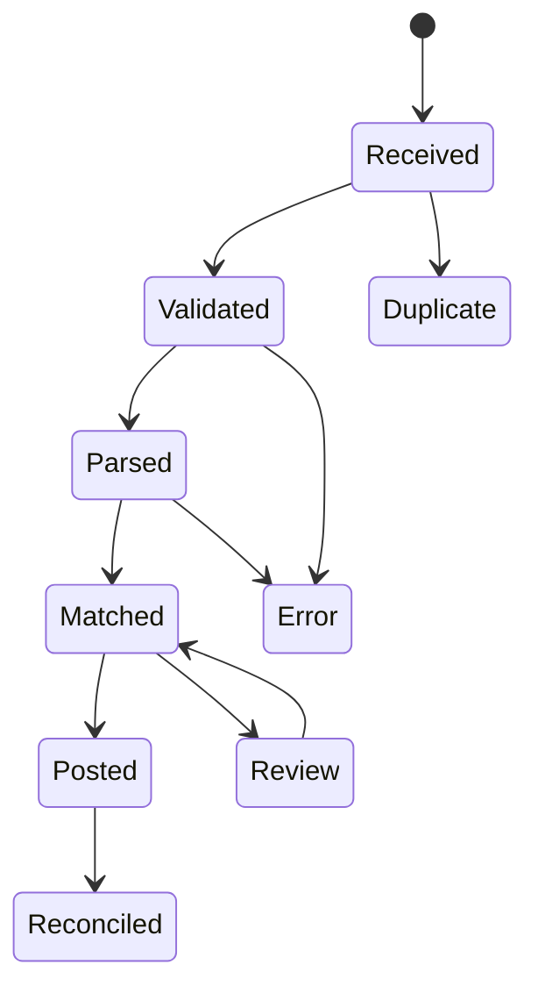
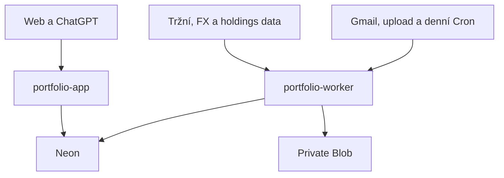

# Portfolio

Osobní aplikace pro automatizovaný sběr, sjednocení a analýzu investic napříč brokery. Cílem je mít jeden důvěryhodný pohled na celé portfolio, přestože jsou investice vedené v různých měnách, na různých platformách a v různých daňových režimech.

Tento dokument je produktová a technická specifikace pro první fázi vývoje. Stav návrhu a externích integrací byl naposledy ověřen 22. 7. 2026.

> [!IMPORTANT]
> Repozitář je veřejný. Nesmí obsahovat reálné výpisy, e-maily, zůstatky, transakce, čísla účtů, přístupové údaje, API klíče ani neanonymizované testovací soubory. Veškerá ukázková data musí být syntetická.

> [!NOTE]
> Aplikace je analytický a evidenční nástroj. Nezadává pokyny brokerům a neposkytuje investiční ani daňové poradenství.

## 1. Cíl projektu

Aplikace má:

- automaticky načítat data z Patria Finance, XTB a České spořitelny / George;
- vést úplnou a auditovatelnou historii transakcí, nikoli pouze aktuální pozice;
- agregovat všechny účty do jednoho dashboardu;
- současně umožnit filtrovat portfolio podle brokera, účtu a režimu `DIP` / `STANDARD`;
- vyhodnocovat výkonnost v CZK a volitelně v EUR;
- porovnávat výkonnost s proxy benchmarky S&P 500, MSCI World a MSCI ACWI;
- ukazovat ekonomickou expozici podle tříd aktiv, sektorů, zemí a měn;
- ukazovat základní look-through expozici fondů a skutečné podkladové pozice;
- poskytovat detailní, výhradně read-only přístup z běžných chatů v ChatGPT;
- minimalizovat ruční práci při každé aktualizaci.

### Hlavní produktové principy

1. **Ledger je zdroj pravdy.** Aktuální pozice a grafy se dopočítávají z neměnné historie událostí.
2. **Automatizace nesmí skrývat chyby.** Každý import má stav, původ, kontrolní součet a výsledek reconciliace.
3. **ISIN má přednost před tickerem.** Ticker se liší podle burzy a datového zdroje; jeden instrument může mít více listingů.
4. **Kontejner není expozice.** DIP je daňový režim účtu, ETF je právní forma instrumentu a akcie je ekonomická expozice. Tyto dimenze se vedou odděleně.
5. **Denní data jsou dostačující.** Aplikace není tradingový terminál a v první fázi nepotřebuje placená real-time data.
6. **Každé číslo musí být vysvětlitelné.** U ceny, FX kurzu, expozice i importu se ukládá zdroj, čas a kvalita.
7. **AI má pouze čtecí přístup.** ChatGPT nikdy nedostane obecný SQL nástroj, přístup k brokerskému účtu ani možnost měnit portfolio.
8. **Cílový hosting je Vercel Hobby.** Produkční web, API a importní úlohy se nasazují z tohoto GitHub monorepa na bezplatný tarif Vercel Hobby. Návrh nesmí vyžadovat automatický upgrade, placený Vercel produkt ani lokální komponentu; při dosažení free-tier limitu má bezpečně omezit nepovinné úlohy a upozornit uživatele.

## 2. Rozsah

### Fáze 1 — povinný rozsah

| Oblast | Rozsah |
| --- | --- |
| Platformy | Patria Finance, XTB, Česká spořitelna / George |
| Daňový režim | `DIP`, `STANDARD`; hlavní dashboard je vždy nejprve agregovaný |
| Měny | primární reportovací měna CZK, přepnutí do EUR |
| Historie | obchody, vklady, výběry, dividendy, úroky, poplatky, daně, FX konverze, převody a relevantní korporátní akce |
| Výkonnost | hodnota portfolia, zisk/ztráta, TWR, XIRR, realizovaný a nerealizovaný výsledek, náklady a příjmy |
| Benchmarky | volitelně S&P 500, MSCI World, MSCI ACWI prostřednictvím jasně označených ETF proxy |
| Expozice | ekonomická třída aktiv, sektor, geografie, měna, základní look-through a míra jeho pokrytí |
| Automatizace | e-mailový import pro George, XTB a realizované obchody z Patrie; kontrolní výpisy a řízený fallback pro úplnost a reconciliaci |
| ChatGPT | read-only Portfolio API a MCP endpoint zabalené jako soukromá ChatGPT app; bez obecného SQL a write nástrojů |
| Provoz | cloud-only single-user aplikace ve dvou projektech na Vercel Hobby; bez lokálního agenta, s auditem importů, monitoringem čerstvosti, kapacity a zálohami |

### Výslovně mimo fázi 1

- plánovaná nebo cílová alokace;
- odchylka od plánované alokace;
- návrhy rebalancování;
- automatické obchodování nebo odesílání pokynů;
- predikce cen a generování investičních doporučení;
- hotové daňové přiznání nebo závazný výpočet daňové povinnosti;
- intradenní a real-time tržní data;
- nativní mobilní aplikace;
- více uživatelů a sdílení portfolia;
- benchmark simulující stejné peněžní toky jako portfolio;
- performance attribution, FX attribution a pokročilé rizikové metriky;
- pokročilá analýza překryvů ETF;
- event-driven Gmail notifikace přes `users.watch` / Pub/Sub;
- automatický Google Drive AI mirror.

Plánovaná alokace a rebalancování mohou být pouze položkou pozdějšího backlogu. V datovém modelu ani UI první fáze pro ně není potřeba vytvářet obrazovky nebo povinná pole.

### Budoucí rozšíření

Datový model má bez migrace základních principů umožnit pozdější přidání například Rentea / DPS, Investown, Conseq, OneInvest a dalších účtů nebo nelikvidních aktiv. `DPS` je proto budoucí hodnota daňového režimu, ne součást první fáze importů.

## 3. Uživatelské rozhraní

### 3.1 Hlavní dashboard

Výchozí pohled zobrazuje celé portfolio dohromady — všechny platformy, DIP i klasické investice. V horní liště jsou globální filtry:

- období: 1M, 3M, YTD, 1Y, 3Y, 5Y, MAX a vlastní rozsah;
- režim: `Vše`, `DIP`, `Klasické`;
- broker a konkrétní účet;
- reportovací měna: CZK / EUR;
- benchmarky: žádný nebo jedna až tři z nabízených proxy řad.

Každý widget respektuje stejné filtry. Aktivní filtr musí být viditelný a sdílený v URL, aby šel konkrétní pohled znovu otevřít.

#### KPI karty

- aktuální tržní hodnota a datum posledního ocenění;
- čisté externí vklady;
- absolutní zisk/ztráta;
- TWR za zvolené období;
- XIRR od založení a případně za zvolené období;
- realizovaný a nerealizovaný výsledek;
- dividendy a úroky;
- poplatky, sražené daně a identifikované FX náklady;
- změna dnes / YTD / od počátku, pouze pokud jsou pro ni dostatečně čerstvá data.

U každého čísla má být tooltip s definicí a odkazem na metodiku. Neúplná hodnota se nezobrazuje jako přesná: dostane stav `estimated`, `partial` nebo `stale`.

#### Graf hodnoty a výkonnosti

Graf v první fázi podporuje dva režimy:

1. **Hodnota portfolia** — tržní hodnota v reportovací měně a volitelně kumulované čisté vklady.
2. **Normalizovaná výkonnost** — portfolio a vybrané ETF proxy benchmarky mají na začátku hodnotu 100; portfolio používá TWR.

Všechny řady se počítají ve stejné reportovací měně a včetně reinvestovaných distribucí, pokud to zvolená proxy umožňuje. Simulace benchmarku se stejnými peněžními toky jako portfolio patří do pozdějšího backlogu.

#### Alokace a expozice

- podle brokera;
- podle daňového režimu (`DIP`, `STANDARD`);
- podle účtu;
- podle právního typu instrumentu: ETF, akcie, podílový fond, dluhopis, crowdfunding, penzijní produkt, hotovost, ostatní;
- podle ekonomické třídy aktiv: akcie, dluhopisy, nemovitosti, PE/VC, hotovost, komodity, ostatní;
- podle sektoru;
- podle geografie;
- podle měnové expozice;
- top 10 přímých i efektivních podkladových pozic.

Sektorová a geografická čísla musí rozlišovat `direct` a `look-through`. Pokud není podkladové složení fondu dostupné, zbytek se vede jako `Unknown`; nesmí se tiše přerozdělit mezi známé položky.

#### Další analytika v první fázi

- podíl hotovosti;
- dividendový a úrokový příjem v čase;
- explicitní poplatky, sražené daně a odhadovaný TER držených fondů, pokud jsou data dostupná;
- čerstvost dat a poslední úspěšná synchronizace každého zdroje.

Performance attribution, FX attribution, drawdown, anualizovaná volatilita, Sharpe, Sortino, HHI a pokročilé koncentrační statistiky jsou záměrně odložené. Datový model je později umožní doplnit bez změny zdroje pravdy.

### 3.2 Detail brokera a účtu

Každý broker má stránku se stejnými základními metrikami jako globální dashboard, ale omezenými na jeho účty. Stránka obsahuje:

- souhrn hodnoty a výkonnosti;
- účty a jejich daňový režim;
- aktuální pozice;
- hotovost podle měny;
- časovou osu transakcí;
- vklady, výběry, poplatky, dividendy a daně;
- stav posledního importu a poslední reconciliace;
- odkaz na zdrojový import bez vystavení citlivého dokumentu v URL.

### 3.3 Holdings

Pozice se primárně agregují podle instrumentu / ISIN napříč brokery. Uživatel může pozici rozbalit na jednotlivé účty a nákupní loty.

Sloupce:

- název, ISIN, ticker a burza použitá pro cenu;
- množství;
- průměrná pořizovací cena pro analytické účely;
- tržní cena, měna, zdroj a čas;
- tržní hodnota;
- nerealizovaný výsledek;
- váha v portfoliu;
- broker, účet a daňový režim;
- kvalita a stáří ocenění.

### 3.4 Transactions

Plně filtrovatelný a exportovatelný ledger. Minimální filtry:

- datum obchodu a vypořádání;
- broker / účet / daňový režim;
- instrument / ISIN;
- typ události;
- měna;
- zdroj importu a stav validace.

Každý řádek zobrazuje hrubou částku, množství, cenu, poplatek, daň, použitý FX kurz a odkaz na auditní stopu. Oprava importu nevynuluje historii: vytvoří storno/reversal a novou opravenou událost.

### 3.5 Exposures

Samostatný analytický pohled pro:

- třídy aktiv;
- sektor;
- zemi a region;
- měnu ekonomické expozice a měnu obchodování;
- základní efektivní podkladové pozice;
- pokrytí look-through daty a jejich datum.

Metodika geografie musí být u každého zdroje popsaná. Země registrace emitenta, země tržeb a klasifikace vydavatele fondu nejsou totéž.

### 3.6 Data sources / Import health

Technická obrazovka, bez které nelze automatizaci považovat za spolehlivou:

- poslední kontrola schránky nebo zdroje;
- poslední nalezený a poslední úspěšný dokument;
- počet importovaných, duplicitních a chybných událostí;
- nereconciliované rozdíly;
- chybějící ceny, FX kurzy a mapování instrumentů;
- stáří portfolio a exposure snapshotů;
- možnost bezpečně zopakovat idempotentní import;
- možnost stáhnout anonymizovaný diagnostický protokol.

## 4. Metodika výpočtů

### 4.1 Čas a měna

- Interní čas se ukládá v UTC; obchodní datum, datum vypořádání a původní časová zóna se zachovají.
- Primární reportovací měna je CZK, volitelná EUR.
- Původní částky a měny se nikdy nepřepisují přepočtenými hodnotami.
- Historická ocenění používají FX kurz příslušného dne, ne dnešní kurz.
- Víkendy a svátky používají poslední známou cenu s příznakem `carried_forward`.

### 4.2 Peněžní toky

Externí cash flow je vklad do investičního systému nebo výběr z něj. Nákup, prodej, dividendová reinvestice a FX konverze uvnitř sledovaného portfolia nejsou externí cash flow. Převod mezi dvěma sledovanými účty se páruje a pro celek je interní; ve view jednoho účtu se může projevit jako transfer.

### 4.3 TWR a XIRR

- **TWR** měří investiční výkonnost očištěnou o načasování externích peněžních toků. Subperiody se dělí v okamžiku cash flow; pokud dokument obsahuje jen datum, použije se jednotná konvence konce dne a ta se uvede v metodice.
- **XIRR / money-weighted return** pracuje se skutečnými daty externích vkladů a výběrů a s koncovou hodnotou portfolia. Vyjadřuje osobní výsledek investora včetně načasování vkladů.

Obě metriky jsou potřebné, protože odpovídají na jinou otázku. UI nesmí jednu označovat pouze obecným slovem „výnos“.

### 4.4 Zisk, náklady a příjmy

- absolutní výsledek = koncová hodnota + externí výběry − externí vklady;
- realizovaný a nerealizovaný výsledek se počítá odděleně;
- poplatky a daně se vedou jako samostatné události, i pokud jsou součástí brokerova souhrnného řádku;
- dividendy a úroky se ukládají v hrubé i čisté podobě, pokud ji dokument poskytuje;
- nákupní loty se zachovají. Metoda agregace pořizovací ceny bude konfigurovatelná a nesmí být prezentována jako daňový výpočet.

### 4.5 Benchmarky

Indexy budou v první fázi reprezentované akumulačními UCITS ETF proxy, protože bezplatné total-return indexové řady nejsou vždy dostupné nebo licenčně použitelné.

| Volba v UI | Výchozí proxy | ISIN | Poznámka |
| --- | --- | --- | --- |
| S&P 500 | CSPX / SXR8 | `IE00B5BMR087` | stejný fond, listing se vybere podle dostupnosti dat |
| MSCI World | IWDA / SWDA / EUNL | `IE00B4L5Y983` | akumulační iShares Core MSCI World UCITS ETF |
| MSCI ACWI | SSAC / IUSQ | `IE00B6R52259` | akumulační iShares MSCI ACWI UCITS ETF |

V UI i exportech se používá název **ETF proxy benchmark**. Výsledek se může od samotného indexu lišit kvůli TER, tracking difference, daním, obchodním hodinám a měnovému přepočtu. Mapování proxy je konfigurovatelné, nikoli natvrdo zakódované v analytice.

### 4.6 Pozdější rizikové metriky

Rizikové a pokročilé koncentrační metriky nejsou součástí prvního releasu. Denní TWR řada a verzovaná data však musí umožnit později korektně dopočítat drawdown, volatilitu, Sharpe, Sortino a HHI. Krátká nebo nekvalitní historie pak musí vracet `insufficient_history`, nikoli zavádějící číslo.

## 5. Získávání dat od brokerů

### 5.1 Doporučená e-mailová infrastruktura

Pro importy je doporučen samostatný bezplatný Gmail účet používaný pouze pro portfolio. Důvody:

- dobře dokumentované Gmail API, OAuth 2.0 a read-only scopes;
- filtrování zpráv a štítky;
- snadný příjem přeposlaných e-mailů z hlavní schránky;
- účet odděluje brokerské dokumenty a OAuth oprávnění od hlavní osobní schránky;

Doporučené Gmail štítky:

- `broker/george`, `broker/xtb`, `broker/patria`.

Stavy `new`, `processed`, `error` a `duplicate` vede aplikace ve své databázi. Importér proto nepotřebuje `gmail.modify` a může zůstat u minimálního oprávnění `gmail.readonly`.

Preferovaný a jediný podporovaný přístup první fáze je serverové Gmail API s OAuth a rozsahem `gmail.readonly`. Jednorázový souhlas proběhne v běžném webovém prohlížeči; získaný refresh token se aplikačně zašifruje a uloží do PostgreSQL. Projekt `portfolio-worker` jednou denně přes Vercel Hobby Cron načte zprávy novější než poslední úspěšný checkpoint. Pro okamžitou kontrolu může přihlášený uživatel použít idempotentní tlačítko „Synchronizovat nyní“. Běžný provoz je plně automatický, pouze může mít prodlevu až přibližně 24 hodin. IMAP, heslo aplikace, Pub/Sub ani lokální e-mailový agent nejsou součástí první fáze.

E-mail je transport a archiv vstupu, nikoli databáze portfolia.

### 5.2 Česká spořitelna / George

Známý vstup:

- elektronický „Přehled obchodů“ zasílaný e-mailem po každé investiční transakci;
- elektronický „Přehled portfolia“ jako kontrolní snapshot, podle nastavení klienta;
- případné historické PDF pro prvotní backfill.

Tok:

1. George odešle výpis do hlavní schránky.
2. Pravidlo jej automaticky přepošle do portfolio Gmailu.
3. Gmail adaptér ověří odesílatele, předmět, MIME typ a kontrolní součet přílohy.
4. Parser vytěží obchod, poplatek, daň, měnu, ISIN a účet.
5. Normalizované události se zapíší do ledgeru.
6. Portfolio výpis se použije pro reconciliaci množství a hotovosti.

PSD2 rozhraní banky se pro investiční portfolio nepovažuje za primární cestu; open-banking API jsou zaměřená hlavně na platební účty.

### 5.3 XTB

Omezení: retailové XTB API bylo 14. 3. 2025 ukončeno. xStation umožňuje export historie do CSV/HTML a XTB zasílá e-mailem zaheslované PDF dokumenty, mimo jiné potvrzení zadaných a provedených pokynů a denní/kvartální výpisy.

Dodaná ukázka potvrzení pokynů ukazuje, že dokument může obsahovat více sekcí:

- provedené nákupní/prodejní příkazy celých cenných papírů (`OMI`);
- provedené nákupy/prodeje frakčních práv;
- souhrn účtu a jeho měny;
- číslo pokynu, symbol, název instrumentu, systém provedení, typ, objem, datum a čas, druh příkazu, cenu, celkovou cenu, třídu aktiva, měnu kotace, směnný kurz, burzovní náklady, provizi a celkové náklady.

Stejné číslo pokynu se může objevit jednou u celého kusu a znovu u frakčního práva. Jde o dvě execution legs jednoho rodičovského pokynu, nikoli o duplicitu. Deduplikační klíč proto nesmí být pouze `order_id`; musí zahrnovat alespoň účet, typ legu, symbol, množství, cenu a čas provedení nebo brokerem dodané unikátní execution ID.

Strategie:

- jednorázový ruční CSV export pro kompletní historický backfill;
- automatický import e-mailových potvrzení a denních výpisů pro nové transakce;
- kvartální PDF jako autoritativní kontrolní snapshot;
- heslo k PDF uložené per účet pouze v aplikačně šifrované podobě; dešifrovat ho smí jen importní projekt;
- CSV/HTML import ponechat jako nouzový fallback a diagnostický nástroj.

#### Uložení hesla k XTB PDF

Heslo k dokumentům není přihlašovací heslo do XTB. Aplikace v první fázi neukládá žádné přihlašovací údaje k brokerskému účtu. Pro Vercel Hobby se nepoužije placený AWS Secrets Manager.

- jednorázově se vygeneruje 32bajtový `MASTER_ENCRYPTION_KEY`; jako Vercel Sensitive Environment Variable bude dostupný pouze produkčnímu projektu `portfolio-worker`;
- uživatel zadá heslo přes přihlášený formulář a TLS; worker jej okamžitě zašifruje pomocí AES-256-GCM s novým náhodným nonce a associated data obsahujícími účet, typ secretu a verzi;
- PostgreSQL uloží pouze `account_id`, `secret_type`, `ciphertext`, `nonce`, `auth_tag`, `key_version` a auditní metadata; databáze ani její zálohy neobsahují plaintext;
- projekty `portfolio-app`, preview deploymenty a AI nástroje nedostanou master key ani databázové oprávnění k tabulce šifrovaných secretů;
- importní worker heslo dešifruje až těsně před zpracováním PDF a používá je pouze v paměti po dobu jedné Function invocation;
- plaintext se neukládá do souboru, logu, cache, error reportu, Blobu ani zálohy; dešifrovaná kopie PDF se také trvale neukládá;
- při chybě vznikne stav `PASSWORD_INVALID` bez zalogování hesla. Nové heslo se přes stejný formulář zašifruje jako nová verze a otestuje na čekajícím PDF; změna nevyžaduje Vercel redeploy;
- rotace master key proběhne řízeným jobem: starý klíč dešifruje všechny hodnoty, nový je znovu zašifruje, ověří a až potom se nasadí nová Vercel proměnná;
- recovery kopie master key se jednorázově uloží do uživatelova cloudového password manageru. Nejde o lokální runtime; bez této kopie by po ztrátě Vercel projektu nebylo možné obnovit šifrované dokumenty a secrety.

Tento model zůstává bezplatný a omezuje dopad úniku samotné databáze, není však ekvivalentem dedikovaného KMS/HSM: kompromitovaný produkční projekt `portfolio-worker` má během běhu možnost data dešifrovat. Pro osobní Hobby provoz je to vědomý a zdokumentovaný trade-off. Kryptografická vrstva proto musí mít malé vendor-neutral rozhraní, aby ji šlo později nahradit spravovaným secret managerem.

PDF pipeline:

1. ověřit povoleného odesílatele, MIME typ a hash šifrované přílohy;
2. načíst heslo podle XTB účtu a dešifrovat PDF v paměti;
3. preferovat textovou a tabulkovou vrstvu PDF, OCR použít jen jako označený fallback;
4. rozpoznat typ dokumentu a jednotlivé sekce;
5. vytvořit rodičovský broker order a jednu nebo více execution legs;
6. validovat součty množství, ceny, provize a celkových nákladů;
7. zaheslovaný originál archivovat podle retenční politiky; neukládat trvale dešifrovanou kopii.

Parser musí správně rozlišit celé cenné papíry, frakční práva, hotovostní operace a dividendy. Ekonomická expozice celého kusu a frakčního práva stejného ETF se může agregovat pod stejný podkladový instrument, právní forma a původní execution legs však zůstanou dohledatelné. Rozdílné XTB obchodní účty jsou samostatné `account` záznamy.

### 5.4 Patria Finance

Patria po provedení pokynu posílá e-mail, jehož tělo obsahuje tabulku realizovaných obchodů. Dodaná ukázka obsahuje pro každý obchod:

- datum obchodu a datum vypořádání;
- počet kusů a cenu za kus;
- směr;
- název cenného papíru a ISIN;
- provizi a poplatek trhu;
- typ pokynu;
- celkovou cenu;
- trh a měnu;
- protistranu, pokud je vyplněna;
- AUV, relevantní zejména u úročených instrumentů.

Tento e-mail je vhodný jako primární inkrementální zdroj realizovaných obchodů. Parser má přednostně číst strukturované `text/html` tělo zprávy přes Gmail API, nikoli screenshot nebo OCR. Musí počítat s více obchody v jednom e-mailu a s tím, že vizuální tabulka skládá jeden obchod z více řádků.

Navržený tok:

1. e-mail se automaticky přepošle do dedikovaného Gmailu a označí `broker/patria`;
2. adaptér ověří odesílatele, hlavičky a hash normalizovaného HTML;
3. parser vytvoří jednu ledger událost pro každý potvrzený obchod a samostatné fee legs;
4. fingerprint kombinuje účet, datum obchodu/vypořádání, ISIN, směr, množství, cenu, celkovou cenu a případný identifikátor z e-mailu;
5. elektronické potvrzení/PDF z WebTraderu a kvartální výpis se použijí pro backfill a reconciliaci; pokud nejsou doručovány e-mailem, nahrají se přes zabezpečený webový import.

Patria poskytuje stav portfolia a transakční historii také v zabezpečeném WebTraderu; elektronické výpisy jsou v klientské části dostupné kvartálně. Veřejně dokumentované retailové portfolio API není součástí návrhu.

Browser automatizace a Playwright nejsou součástí první fáze. Aplikace nebude ukládat přihlašovací údaje do Patrie ani automatizovat přihlášení do WebTraderu. Pokud kontrolní report nepřijde e-mailem, uživatel jej jednorázově stáhne a nahraje přes webové UI; na počítači kvůli tomu neběží žádná služba ani lokální zpracování.

E-mailové potvrzení nemusí pokrýt dividendy, hotovostní pohyby, korporátní akce ani zrušené/neprovedené pokyny. Úplnost portfolia se proto stále ověřuje kontrolními výpisy. UI ukazuje samostatně čerstvost průběžných obchodů a datum poslední úplné reconciliace.

### 5.5 Importní pipeline



Každý import ukládá:

- broker, účet a typ dokumentu;
- Gmail `message_id`, identifikátor MIME části a podle typu vstupu SHA-256 přílohy nebo kanonizovaného HTML/textového těla;
- datum přijetí a období dokumentu;
- verzi parseru;
- počet nalezených, přijatých a odmítnutých událostí;
- anonymizovanou chybu a stav;
- vazbu každé ledger události na zdrojový dokument.

Idempotence je povinná. Stejná zpráva, příloha nebo brokerova transakce nesmí vytvořit druhou událost ani při opakovaném spuštění importu.

### 5.6 Reconciliace

Poziční snapshot z výpisu se porovná s pozicí dopočítanou z ledgeru:

`opening quantity + buys + transfers in + corporate actions − sells − transfers out = closing quantity`

Obdobně se kontroluje hotovost podle měny. Tolerance je explicitní a závisí na typu instrumentu. Rozdíl vytvoří `data_quality_issue`, který se neztratí při dalším importu, dokud není vysvětlen nebo opraven.

## 6. Tržní, FX a look-through data

### 6.1 Princip provider abstraction

Bezplatný zdroj nemá garantované pokrytí všech evropských listingů. Aplikace proto používá rozhraní poskytovatele, cache a fallback řetězec. Každý datový bod ukládá `provider`, `as_of`, `retrieved_at`, `quality`, `currency` a případnou poznámku k licenci.

Navržený řetězec pro denní ceny:

1. Twelve Data jako preferovaný dokumentovaný zdroj, pokud bezplatný tarif skutečně pokrývá konkrétní listing;
2. Alpha Vantage jako dokumentovaný fallback s nízkým denním limitem;
3. Stooq pro historický backfill tam, kde je symbol dostupný;
4. Yahoo Finance přes neoficiální adaptér pouze jako best-effort fallback;
5. oficiální NAV nebo factsheet emitenta fondu;
6. poslední známá cena označená `stale`, nikdy tiché dosazení nuly.

Limity a pokrytí bezplatných tarifů se mění. Nejsou zakódované jako produktový předpoklad; při implementaci se spustí acceptance test na všech reálně držených ISIN/listinzích a výsledek se uloží do `instrument_price_source` konfigurace.

Pro osobní EOD dashboard je důležitější konzistence, adjusted historie a správná měna než real-time quote.

### 6.2 FX

- primární zdroj pro přepočet do CZK: oficiální denní kurzovní lístky ČNB;
- fallback a křížové EUR kurzy: ECB reference rates;
- brokerem skutečně použitý kurz se zachová u transakce, pokud je ve výpisu;
- pro ocenění se používá referenční kurz; pro vyhodnocení skutečných nákladů brokerů transakční kurz;
- kurzový zdroj a konvence musí být viditelné v metodice.

### 6.3 Identifikace instrumentů

- primární identifikátor fondu nebo cenného papíru: ISIN;
- listing: ISIN + MIC burzy + ticker + obchodní měna;
- OpenFIGI lze použít pro mapování ISIN na FIGI a burzovní symboly;
- automatické mapování s více kandidáty vytvoří úkol k ručnímu potvrzení;
- ručně potvrzené mapování se verzovaně uloží a parser ho znovu nepřepisuje.

### 6.4 Složení fondů a look-through

Preferují se oficiální zdroje vydavatelů fondů, například detailní holdings soubory iShares, DWS/Xtrackers a Avantis. Importér uchovává:

- fond, datum složení a zdroj;
- podkladový ISIN / název / zemi / sektor / měnu;
- váhu;
- míru pokrytí a součet vah;
- původní klasifikaci a normalizovanou interní klasifikaci.

Efektivní váha podkladu v portfoliu je váha fondu v portfoliu násobená vahou podkladu ve fondu. Přímé držení stejné firmy se následně přičte. V první fázi se tento výpočet používá pro sektorovou, geografickou a měnovou expozici a pro základní top podkladové pozice; samostatná analýza překryvů mezi ETF je odložená.

## 7. Architektura

Cloud-only architektura běží ve dvou projektech na Vercel Hobby a nevyžaduje instalaci agenta, lokální plánované úlohy ani úložiště na uživatelově počítači. Rozdělení zachovává jedinou důležitou bezpečnostní hranici: veřejná read-only aplikace nemá přístup k importním secretům ani databázovému zápisu.



### 7.1 Komponenty

| Komponenta | Odpovědnost |
| --- | --- |
| Hosting a CI/CD | dva bezplatné Vercel Hobby projekty napojené na jeden GitHub repozitář |
| `portfolio-app` | Next.js / React; dashboard, single-user přihlášení, read-only Route Handlers, REST API, MCP endpoint a import health |
| `portfolio-worker` | Python Vercel Functions; Gmail synchronizace, parsování, ceny, FX, fund holdings, snapshots, reconciliace a zálohy |
| Scheduler | Vercel Hobby Cron jednou denně; stejné idempotentní zpracování lze spustit chráněným „Synchronizovat nyní“ |
| Databáze | Neon PostgreSQL Free; canonical ledger, šifrované dynamické secrety a odvozené snapshoty |
| Raw archive | privátní Vercel Blob; originální dokumenty navíc aplikačně šifrované před uložením |
| Secrets | `MASTER_ENCRYPTION_KEY` jako Vercel Sensitive Environment Variable jen v `portfolio-worker`; Gmail token a XTB heslo jako AES-256-GCM ciphertext v Neon |
| ChatGPT | read-only MCP nástroje jako součást `portfolio-app`; žádný samostatný AI backend |

Samostatný třetí projekt pro read API se nepoužije. Next.js Route Handlers obslouží dashboardové API i `/mcp`; výpočty a snapshots připravuje worker a aplikace je čte přes omezenou databázovou roli. Tím odpadají další deployment, URL, CORS, vzájemná autentizace a synchronizace preview prostředí.

Vercel Functions jsou bezstavové a neběží nepřetržitě. Stav úloh drží databázová tabulka jobů. Každý job je idempotentní, používá PostgreSQL advisory lock a umí pokračovat po menších dávkách z checkpointu. Redis, Vercel Queues ani Vercel Workflows nejsou součástí první fáze.

### 7.2 Nasazení a oprávnění

Jeden GitHub repozitář se připojí ke dvěma Vercel projektům s různými root directories a oprávněními:

| Vercel projekt | Obsah | Oprávnění |
| --- | --- | --- |
| `portfolio-app` | Next.js dashboard, read API a MCP | uživatelská session a PostgreSQL read role; bez master key, raw Blobu a tabulky šifrovaných secretů |
| `portfolio-worker` | importní a analytické Functions + Cron endpointy | PostgreSQL write role, tabulka šifrovaných secretů, private Blob a produkční master key |

Cílová varianta:

- oba projekty zůstávají na Vercel Hobby; fáze 1 nevyžaduje placený Vercel produkt ani automatický upgrade;
- GitHub `main` nasazuje production, pull requesty vytvářejí Vercel Preview deployments;
- preview používá pouze syntetické fixtures a nemá připojení k produkční Neon databázi, Blobu ani produkčním secretům;
- přístup je single-user; konkrétní autentizační knihovna se zvolí při implementaci bez budování obecného multi-user systému;
- serverový Gmail adaptér používá aplikačně šifrovaný OAuth refresh token a funguje i při vypnutém počítači uživatele;
- heslo k XTB PDF je samostatný verzovaný šifrovaný záznam dostupný pouze workeru;
- Vercel Sensitive Environment Variables drží statickou deployment konfiguraci a master key. Uživatelsky měnitelné XTB heslo a Gmail refresh token jsou zašifrované v Neon, takže jejich změna nevyžaduje redeploy;
- privilegované akce z UI, například „Synchronizovat nyní“, upload nebo změna XTB hesla, volají úzký chráněný worker endpoint s krátkodobě podepsaným požadavkem; worker nevystavuje obecné write API;
- raw dokumenty se před uložením aplikačně zašifrují klíčem odvozeným od master key pomocí HKDF s odděleným účelem a uloží do private Vercel Blob;
- citlivé odpovědi používají `Cache-Control: private, no-store` a nesmí se uložit do Vercel CDN cache;
- žádná část systému nevyžaduje lokální službu, cron, Docker, keychain ani trvale zapnutý osobní počítač;
- Vercel region funkcí se umístí co nejblíže regionu Neon databáze.

### 7.3 Denní úlohy a ruční synchronizace

- Denní Vercel Hobby Cron v `portfolio-worker` zkontroluje Gmail s malým časovým překryvem před posledním úspěšným checkpointem, importuje nové dokumenty a zaznamená nový checkpoint až po úspěšném dokončení. Opakovaně načtené zprávy bezpečně odfiltruje Gmail `message_id` a importní fingerprint.
- Samostatné denní joby načtou ceny a FX, vytvoří snapshots, provedou rychlou reconciliaci a vytvoří šifrovanou aplikační zálohu.
- Tlačítko „Synchronizovat nyní“ spustí stejný idempotentní Gmail job; není pro běžný provoz povinné a slouží jen tehdy, když uživatel nechce čekat na další denní běh.
- Každý Cron a worker endpoint je autentizovaný, idempotentní a pracuje v UTC.
- Import jednoho dokumentu a jeden analytický batch musí skončit do 300 sekund. Velký backfill se rozdělí na joby s checkpointem; po timeoutu pokračuje další invocation.
- Event-driven Gmail `users.watch` / Pub/Sub lze přidat později pouze tehdy, pokud se denní prodleva ukáže jako reálný problém.

### 7.4 Rozpočet bezplatných tarifů

Limity níže byly ověřeny 22. 7. 2026. Poskytovatelé je mohou změnit; implementace je proto nesmí považovat za neměnnou konstantu.

| Služba | Publikovaný bezplatný limit | Důsledek pro návrh |
| --- | --- | --- |
| Vercel Hobby Cron | nejvýše 100 definic na projekt, každá maximálně jednou denně; přesnost v rámci hodiny (±59 minut) | denní Gmail synchronizace a dávkové úlohy; žádný častý polling |
| Vercel Hobby Functions | 4 hodiny active CPU, 360 GB-h provisioned memory a 1 milion invocations v zahrnutém měsíčním využití; max. 300 s, 2 GB / 1 vCPU na invocation | malé dávky, checkpointy a žádné dlouhé procesy |
| Vercel Blob Hobby | 1 GB uložených dat, prvních 10 000 simple operations, 2 000 advanced operations a 10 GB transferu | privátní šifrovaný archiv s omezenou retencí |
| Neon Free | 100 CU-h/projekt/měsíc, 0,5 GB/projekt, 5 GB public transfer/měsíc, scale-to-zero po 5 minutách, 6hodinové restore okno a jeden ruční snapshot; bez scheduled backups | jeden produkční root branch, kompaktní data a vlastní aplikační záloha |

Provozní pravidla pro zachování ceny 0:

- žádná služba nesmí mít automatický přechod na placený tarif; změna tarifu je vždy nové explicitní rozhodnutí uživatele;
- dva projekty se nepovažují za násobení kvót; spotřeba se kontroluje podle skutečného scope v Hobby usage dashboardu;
- první fáze nebuduje vlastní integraci na všechny provider usage metriky. Vercel a Neon usage se kontrolují v jejich dashboardech, zejména před velkým backfillem;
- aplikace sama sleduje jen akční provozní údaje: úspěšnost a čerstvost jobů, velikost databáze, evidovanou velikost Blob objektů a poslední obnovitelnou zálohu;
- při 80 % kapacity databáze nebo Blobu vznikne upozornění. Importy a zálohy mají přednost před obnovou starých look-through dat;
- protože Neon Free nemá plánované zálohy a nabízí jen krátké restore okno, `portfolio-worker` denně vytvoří komprimovaný aplikační export ledgeru, mapování a konfigurace, zašifruje jej a uloží do private Blobu. Výchozí retence je 7 denních a 4 týdenní body obnovy;
- „bezplatný provoz“ znamená žádný povinný placený plán při běžném osobním objemu v aktuálních free-tier kvótách. Není to doživotní garance podmínek třetích stran.

### 7.5 Navržená struktura repozitáře

```text
portfolio/
├── apps/
│   ├── app/                 # Next.js dashboard, read API a MCP
│   └── worker/              # Python importy, ocenění, snapshots a reconciliace
├── packages/
│   └── contracts/           # sdílené API/MCP schemas a doménové enumy
├── migrations/
├── tests/
│   ├── fixtures-synthetic/
│   ├── golden/
│   ├── integration/
│   └── e2e/
├── docs/
│   ├── methodology.md
│   ├── data-sources.md
│   ├── security.md
│   └── adr/
├── infra/
├── .env.example
└── README.md
```

Verze frameworků se zvolí při založení projektu podle aktuálních stabilních/LTS vydání a uzamknou lockfilem; README je záměrně nepřipíná na čísla, která rychle zastarávají.

## 8. Doménový model

### 8.1 Hlavní entity

| Entita | Klíčová pole a účel |
| --- | --- |
| `broker` | Patria, XTB, George; normalizované jméno a konfigurace adaptéru |
| `account` | broker, externí pseudonym, měny, `tax_wrapper`, aktivní období |
| `instrument` | ISIN, název, právní typ, ekonomická třída, domicile, emitent |
| `listing` | instrument, MIC, ticker, obchodní měna, provider symboly |
| `broker_order` | účet, externí číslo pokynu, čas a souhrn rodičovského pokynu |
| `execution_leg` | vazba na pokyn, celé CP / frakční právo, množství, cena, venue, náklady a fingerprint |
| `ledger_event` | append-only ekonomická událost s datem, množstvím, částkami a zdrojem |
| `cash_leg` | měna, částka, směr a vazba na událost; FX konverze má nejméně dvě nohy |
| `lot` | nákupní množství, pořizovací cena a následná alokace prodeje |
| `raw_import` | hash, broker, dokument, parser version, stav, audit |
| `encrypted_secret` | účet/typ, ciphertext, nonce, auth tag, key version a audit; žádný plaintext |
| `price` | listing/instrument, datum, close/NAV, měna, provider, quality |
| `fx_rate` | datum, pár, kurz, provider a konvence |
| `position_snapshot` | odvozené množství a hodnota účtu k datu |
| `portfolio_snapshot` | denní agregovaná hodnota, externí flow a výnos |
| `fund_holding_snapshot` | look-through složení fondu k datu |
| `exposure_snapshot` | agregace podle třídy, sektoru, země, měny a podkladu |
| `benchmark_series` | verzovaná proxy a denní přepočtená řada |
| `data_quality_issue` | rozdíl, chybějící data, závažnost, stav a vysvětlení |

### 8.2 Daňový režim

`tax_wrapper` je vlastnost účtu, nikoli brokera nebo instrumentu:

```text
DIP
STANDARD
# future: DPS
```

Jeden broker může mít více účtů s různými režimy. Hlavní dashboard agreguje vše; globální filtr stejná data rozdělí. Všechny relevantní dotazy, snapshots a AI nástroje proto přijímají volitelný `tax_wrapper` filtr.

### 8.3 Typ události

Minimální enum:

```text
BUY
SELL
DEPOSIT
WITHDRAWAL
DIVIDEND
INTEREST
FEE
TAX
FX_CONVERSION
TRANSFER_IN
TRANSFER_OUT
SPLIT
MERGER
SPINOFF
RETURN_OF_CAPITAL
ADJUSTMENT_REVERSAL
```

Brokerův řádek lze rozložit na jednu hlavní událost a více peněžních noh. Například BUY obsahuje množství a cenu instrumentu, hrubou hotovostní nohu a samostatný poplatek. Zdrojová čísla zůstanou dohledatelná.

### 8.4 Důležité invariants

- ledger událost se po zaúčtování nemění; oprava probíhá reverzní událostí;
- stejný `source_fingerprint` je možné zaúčtovat nejvýše jednou;
- externí číslo pokynu samo o sobě není unikátní klíč execution legu;
- celý kus a frakční právo téhož podkladu se agregují ekonomicky, ale zachovávají oddělenou právní formu a auditní stopu;
- součet cash legs jedné FX konverze je po přepočtu vysvětlitelný kurzem a poplatkem;
- quantity instrumentu nesmí být bez explicitní short pozice záporná;
- každý denní snapshot odkazuje na konkrétní sadu cen a FX kurzů;
- součet známých a `Unknown` look-through vah odpovídá pokrytí fondu;
- `DIP` / `STANDARD` se dědí z účtu a nekopíruje jako editovatelná pravda do každé transakce.

## 9. API

Dashboard i AI používají stejnou aplikační vrstvu. Příklad read API:

```text
GET /v1/portfolio/summary
GET /v1/portfolio/performance
GET /v1/portfolio/holdings
GET /v1/portfolio/exposures
GET /v1/portfolio/income
GET /v1/portfolio/costs
GET /v1/transactions
GET /v1/accounts
GET /v1/brokers/{broker_id}
GET /v1/data-quality/issues
GET /v1/imports/status
GET /v1/methodology
```

Společné parametry:

```text
from, to, reporting_currency, broker_id, account_id, tax_wrapper, benchmark
```

Write API je oddělené a dostupné pouze interním importérům s jiným oprávněním. OpenAPI kontrakt je verzovaný. Velké seznamy používají cursor pagination; částky se přenášejí jako decimal string, ne binární float.

## 10. Přístup z ChatGPT

### 10.1 Požadovaný výsledek

Uživatel má být schopný otevřít běžný chat, přidat svou Portfolio app mezi nástroje konverzace a zeptat se například:

- „Jaká je moje efektivní expozice na USA po započtení ETF?“
- „Kolik jsem od začátku zaplatil na poplatcích u jednotlivých brokerů?“
- „Porovnej DIP a klasické investice za poslední tři roky.“
- „Jaké jsou moje největší efektivní podkladové pozice?“
- „Proč se liší TWR a XIRR?“
- „Jsou data všech brokerů aktuální a reconciliovaná?“

### 10.2 Primární integrace: read-only ChatGPT app / MCP

`portfolio-app` vystaví veřejný HTTPS `/mcp` endpoint nad stejnou read aplikační vrstvou jako dashboard. Soukromě připojená ChatGPT app nemá obecný HTTP proxy ani SQL nástroj; publikuje pouze omezené analytické nástroje:

```text
get_portfolio_summary
get_performance
get_holdings
get_transactions
get_exposures
get_income_and_costs
get_import_status
get_data_quality_issues
get_methodology
```

Každý nástroj:

- je read-only;
- má omezený rozsah parametrů a maximální velikost odpovědi;
- podporuje `DIP`, `STANDARD` i agregovaný pohled;
- vrací `as_of`, `data_freshness`, `currency`, `methodology_version` a zdroje;
- loguje přístup bez ukládání obsahu odpovědi s citlivými daty;
- nikdy nevrací e-mailové tokeny, raw dokumenty ani čísla brokerských účtů.

ChatGPT app se po jednorázovém připojení vybírá jako nástroj konkrétní nové konverzace; není automaticky aktivní ve všech chatech. Jde stále o běžný chat, ale uživatel musí Portfolio app do jeho kontextu přidat. Dostupnost developer mode a konkrétní autentizační tok se ověří acceptance testem na cílovém ChatGPT účtu.

### 10.3 Google Drive pouze jako pozdější contingency

Automatický Google Drive AI mirror není součástí první fáze. Duplikoval by citlivá portfolio data, OAuth oprávnění i synchronizační logiku. Implementuje se pouze tehdy, pokud acceptance test prokáže, že soukromá MCP app není na konkrétním ChatGPT účtu prakticky použitelná. Ani potom Drive nebude source of truth a nebude umožňovat zápis zpět do portfolia.

## 11. Bezpečnost a soukromí

### Threat model

Chráněná aktiva:

- historie portfolia a zůstatky;
- raw výpisy a jejich hesla;
- Gmail OAuth token;
- API a AI přístupové tokeny;
- šifrovací a zálohovací klíče.

Přihlašovací údaje a session do Patrie, XTB ani George nejsou aktivem aplikace, protože do systému vůbec nevstupují.

Povinná opatření:

- žádné secrets v Gitu, Docker image, logu nebo analytice;
- `.env.example` pouze s názvy proměnných a bezpečnými placeholdery;
- OAuth scopes s nejmenším oprávněním, pro Gmail primárně read-only;
- oddělené databázové role pro `portfolio-worker` a read-only `portfolio-app` včetně MCP;
- pouze produkční `portfolio-worker` dostane `MASTER_ENCRYPTION_KEY`; `portfolio-app`, MCP a preview prostředí ho nedostanou;
- Gmail refresh token a XTB PDF heslo jsou v databázi pouze jako AES-256-GCM ciphertext s unikátním nonce, auth tagem, associated data a verzí klíče;
- Vercel Sensitive Environment Variable obsahuje jen dlouhodobě stabilní master key a statickou deployment konfiguraci; dynamické secrety lze měnit bez redeploye;
- každé dešifrování a každá změna secretu se audituje bez hodnoty secretu;
- master key má oddělenou recovery kopii v cloudovém password manageru a dokumentovaný rotační postup;
- TLS, bezpečné cookies, CSRF ochrana a rate limiting;
- šifrování databáze/disku a aplikační šifrování zvlášť citlivých raw dokumentů;
- heslo k PDF ukládat v jiné logické vrstvě než dokument a pro každý účel odvozovat doménově oddělený klíč;
- redakce PII a částek v chybových zprávách;
- audit přihlášení a importů;
- denní aplikační zálohy a pravidelně ověřená obnova;
- možnost zneplatnit AI token bez dopadu na dashboard;
- Content Security Policy a zákaz veřejných object-storage URL;
- dependency a secret scanning v CI.

Raw dokumenty lze po úspěšné reconciliaci přesunout do dlouhodobého šifrovaného archivu. Retence se nastaví před ostrým provozem. Mazání raw dokumentu nesmí rozbít auditní metadata a hash.

## 12. Spolehlivost a observability

Plánované a ručně spustitelné úlohy:

| Úloha | Doporučená frekvence |
| --- | --- |
| kontrola Gmailu | jednou denně přes Vercel Hobby Cron; volitelně „Synchronizovat nyní“ |
| ceny a benchmarky | jednou denně po uzavření relevantních trhů |
| ČNB / ECB FX | jednou denně |
| portfolio snapshot | po novém importu a po denních cenách |
| fund holdings | týdně až měsíčně; denní job pouze zjistí, zda je refresh splatný |
| reconciliace | po každém kontrolním výpisu a jednou denně rychlá kontrola |
| šifrovaná aplikační záloha | jednou denně, retence 7 denních + 4 týdenní body |

Sledovat minimálně:

- `last_success_at` a poslední úspěšný Gmail checkpoint pro každý konektor;
- počet nových, duplicitních a chybných importů;
- délku fronty, počet retry a dobu zpracování;
- chybějící cenu / FX / instrument mapping;
- počet otevřených reconciliation issues;
- stáří snapshotů a poslední úspěšnou obnovitelnou zálohu;
- velikost databáze a evidovanou velikost private Blob objektů;
- počet přístupů přes MCP a zamítnuté autorizace.

Vercel Function usage a Neon CU-hours se v první fázi kontrolují v dashboardech poskytovatelů, nikoli vlastní složitou integrací. Alarm má být akční: například „XTB e-mail nebyl 30 dní“ nemusí být chyba, pokud nebyla transakce. Kritičtější je neúspěšné zpracování přijatého výpisu, starý kontrolní snapshot, neobnovitelná záloha nebo překročení interního kapacitního prahu.

## 13. Testování

### Testovací vrstvy

- unit testy doménových výpočtů, FX a klasifikace cash flow;
- golden-file testy každého parseru na syntetických a anonymizovaných dokumentech;
- property testy invariantů ledgeru a idempotence;
- integrační testy databáze, migrací a provider fallbacků;
- contract testy OpenAPI a MCP odpovědí;
- end-to-end test hlavního dashboardu a filtrů `Vše / DIP / Klasické`;
- restore test zálohy;
- bezpečnostní test, že AI endpointy nemají write schopnost.

### Povinné scénáře

- opakovaný import stejného e-mailu nevytvoří duplicitu;
- stejná transakce v denním a kvartálním výpisu se spáruje;
- Patria HTML e-mail se dvěma obchody vytvoří právě dvě obchodní události a odpovídající fee legs;
- změna vizuálního formátování Patria e-mailu nevede k OCR, pokud zůstává dostupná HTML tabulka;
- XTB PDF se správným heslem se dešifruje v paměti; chybné heslo vytvoří bezpečnou, nerepetitivní chybu bez úniku hesla do logu;
- XTB pokyn rozdělený na celý kus a frakční právo vytvoří jeden rodičovský pokyn a dva legy, nikoli duplicitu;
- pouze `portfolio-worker` má master key, write roli a oprávnění číst `encrypted_secret`; `portfolio-app` včetně MCP dostane explicitní `access denied`;
- změna jediného bitu v ciphertextu, nonce, auth tagu nebo associated data vede k bezpečnému selhání dešifrování;
- rotační job znovu zašifruje a ověří všechny secrety před odstavením staré verze klíče;
- serverový Gmail import a denní ocenění proběhnou i při vypnutém uživatelském počítači;
- opakovaný denní Gmail import ani ruční „Synchronizovat nyní“ nevytvoří duplicitní událost;
- manifest Vercel Hobby Cron neobsahuje žádný plán častější než jednou denně;
- souběžné nebo opakované Vercel Cron invocation zarezervují nejvýše jeden aktivní job;
- job přerušený limitem 300 sekund pokračuje z posledního databázového checkpointu;
- raw dokument v private Vercel Blob nelze načíst bez autorizace a po uložení odpovídá aplikačně šifrovanému obsahu;
- nákup v EUR, ocenění v CZK a následná FX změna;
- převod mezi dvěma sledovanými účty nemění výnos celého portfolia;
- split nebo jiná korporátní akce zachová ekonomickou hodnotu;
- chybějící cena vytvoří označenou mezeru/stale hodnotu, ne nulu;
- filtr DIP nemění data klasického účtu a naopak;
- agregovaný dashboard se rovná součtu účtů po eliminaci interních převodů;
- parser update lze bezpečně přehrát nad raw importem bez dvojího zaúčtování.

## 14. Vývojový plán

### Milník 0 — discovery a fixtures

- získat po jednom reprezentativním dokumentu a kompletní historický export z každé platformy;
- vytvořit bezpečně anonymizované nebo plně syntetické golden fixtures;
- sepsat přesné mapování polí a brokerových typů transakcí;
- ověřit všechny reálné ISIN/listingy u bezplatných price providerů;
- založit dva Vercel Hobby projekty (`portfolio-app`, `portfolio-worker`), Neon Free databázi a private Blob;
- vygenerovat master key, uložit jej pouze do `portfolio-worker` jako Sensitive Environment Variable a recovery kopii do cloudového password manageru;
- rozhodnout raw/backup retention, single-user autentizaci a EU region;
- založit ADR pro ledger, import fingerprints, FX konvenci a benchmarky.

### Milník 1 — canonical ledger a ruční backfill

- monorepo, CI, databáze a migrace;
- GitHub → Vercel production/preview deployment se striktně oddělenými daty;
- broker/account/instrument/listing model;
- append-only ledger a import audit;
- XTB CSV a dostupné George/Patria historické importy;
- reconciliation engine;
- základní holdings a transactions UI.

### Milník 2 — automatické nové transakce

- dedikovaný Gmail, OAuth a filtry;
- XTB zaheslovaný PDF parser, George PDF parser a Patria HTML e-mail parser;
- idempotentní worker, error queue a import health;
- kvartální reconciliation;
- zabezpečený webový import kontrolních reportů, které nejsou dostupné e-mailem;
- upozornění na chybu nebo zastaralá data.

### Milník 3 — dashboard a analytika

- denní ceny, FX a snapshots;
- globální dashboard a filtry `Vše / DIP / Klasické`;
- TWR, XIRR, realizovaný/nerealizovaný výsledek, příjmy a náklady;
- ETF proxy benchmarky v režimu normalizované výkonnosti;
- sektorová, geografická, měnová a asset-class expozice;
- základní fund look-through, míra pokrytí a top podkladové pozice.

### Milník 4 — ChatGPT a hardening

- read-only Portfolio API jako Next.js Route Handlers v `portfolio-app`;
- MCP endpoint a soukromá ChatGPT app/plugin;
- acceptance test dostupnosti a používání app v běžném ChatGPT chatu;
- bezpečnostní review, rate limits a audit;
- backup/restore drill;
- provozní dokumentace a runbook.

### Pozdější backlog

- Rentea / DPS, Investown, Conseq, OneInvest a další zdroje;
- více metod ocenění nelikvidních aktiv;
- tax-lot reporty jako analytická pomůcka;
- plánovaná alokace, odchylky a rebalancování — až po samostatném produktovém rozhodnutí;
- mobilní/PWA optimalizace;
- notifikace a periodické portfolio reporty;
- event-driven Gmail import přes `users.watch` / Pub/Sub, pouze pokud denní synchronizace nestačí;
- Google Drive AI mirror, pouze pokud MCP acceptance test nevyhoví;
- benchmark se stejnými peněžními toky jako portfolio;
- performance a FX attribution;
- drawdown, volatilita, Sharpe, Sortino, HHI a pokročilé koncentrační metriky;
- pokročilá analýza překryvů mezi ETF.

## 15. Definition of Done pro fázi 1

Fáze 1 je hotová, pokud:

1. existuje kompletní počáteční historie pro Patrii, XTB a George nebo je každá známá mezera viditelně označena;
2. nové George, XTB a Patria obchody z podporovaných e-mailů se bez ručního importu objeví v aplikaci;
3. Patria má funkční proces kontrolního výpisu/fallbacku a odděleně viditelnou čerstvost obchodů a poslední úplné reconciliace;
4. opakovaný import nevytváří duplicity;
5. vypočtené pozice se reconciliují s kontrolními výpisy;
6. hlavní dashboard agreguje všechny účty a umí `Vše / DIP / Klasické`;
7. fungují CZK i EUR pohledy a historické FX přepočty;
8. graf porovnává portfolio se všemi třemi ETF proxy benchmarky;
9. jsou dostupné TWR, XIRR, realizovaný/nerealizovaný výsledek, příjmy a náklady;
10. asset-class, sektorová, geografická a měnová expozice ukazuje také míru pokrytí;
11. ChatGPT může přes read-only rozhraní získat detail holdings, transakcí, výkonu, expozic a čerstvosti dat;
12. žádný AI nástroj ani dashboard neumí zadat obchod;
13. záloha byla úspěšně obnovena v odděleném prostředí;
14. repozitář a test fixtures neobsahují osobní finanční data ani secrets;
15. pravidelná aktualizace funguje bez lokálního agenta a bez zapnutého osobního počítače;
16. produkce běží na Vercel Hobby a preview deployment nemá přístup k produkční databázi, Blob ani secretům;
17. reprezentativní měsíc provozu zůstane pod limity Vercel Hobby, Neon Free a Vercel Blob Hobby a žádná komponenta nevyžaduje placený tarif;
18. produkční nasazení používá pouze dva Vercel projekty a `portfolio-app` nemá přístup k master key, Gmail/XTB secretům ani databázovému zápisu.

## 16. Otevřená rozhodnutí před implementací

Nejde o změny produktového směru, ale o technická rozhodnutí, která vyžadují vzorky dokumentů nebo cílové prostředí:

- přesné varianty HTML/PDF/CSV každého brokera a jejich změny v čase;
- přesný EU region Vercel Functions a Neon databáze;
- acceptance test Vercel Python Runtime pro velikost PDF dependencies, cold start a limit 300 sekund;
- způsob single-user autentizace;
- retenční doba raw výpisů a výsledný kapacitní rozpočet pod 1 GB Vercel Blob;
- ověření, zda retence 7 denních + 4 týdenních aplikačních záloh stačí pro obnovu a vejde se do Blob limitu;
- UX a recovery postup při rotaci nebo zapomenutí hesla k XTB PDF a při ztrátě master key;
- tolerance reconciliace pro frakční instrumenty;
- výchozí analytická metoda pořizovací ceny;
- dostupnost developer mode / soukromé app v konkrétním ChatGPT účtu;
- pravidla pro manuální ocenění budoucích nelikvidních aktiv.

## 17. Oficiální zdroje a technické reference

### Broker importy

- [XTB: ukončení API](https://www.xtb.com/int/help-center/our-platforms-6-4/does-xtb-offer-investment-automation-tools-4)
- [XTB: denní a kvartální výpisy](https://www.xtb.com/cz/help-center/obchodni-ucet-2/denni-a-kvartalni-vypisy)
- [XTB: export historie do CSV/HTML](https://www.xtb.com/en/help-center/our-platforms-6/history-on-the-xstation-platform)
- [Patria Finance: elektronické výpisy a portfolio](https://finance.patria.cz/vzdelavani/faq-investovani)
- [Česká spořitelna: investiční dokumentace a výpisy](https://www.csas.cz/banka/content/inet/internet/cs/RR_SK.INV..xml%2Cpdf_IE)

### E-mail a ChatGPT

- [Gmail API overview](https://developers.google.com/workspace/gmail/api/guides)
- [Gmail API: attachments.get](https://developers.google.com/workspace/gmail/api/reference/rest/v1/users.messages.attachments/get)
- [OpenAI: Apps in ChatGPT](https://help.openai.com/en/articles/11487775-connectors-in-chatgpt)
- [OpenAI: developer mode and MCP apps](https://help.openai.com/en/articles/12584461-developer-mode-and-mcp-apps-in-chatgpt)
- [OpenAI Apps SDK](https://developers.openai.com/apps-sdk)
- [OpenAI Apps SDK: connect from ChatGPT](https://developers.openai.com/apps-sdk/deploy/connect-chatgpt)

### Vercel a cloud infrastruktura

- [Vercel pricing a Hobby allowances](https://vercel.com/docs/pricing)
- [Vercel Functions](https://vercel.com/docs/functions)
- [Vercel Functions API / Next.js Route Handlers](https://vercel.com/docs/functions/functions-api-reference)
- [Vercel Functions limits](https://vercel.com/docs/functions/limitations)
- [FastAPI na Vercelu](https://vercel.com/docs/frameworks/backend/fastapi)
- [Vercel Cron Jobs](https://vercel.com/docs/cron-jobs)
- [Vercel Cron usage and pricing](https://vercel.com/docs/cron-jobs/usage-and-pricing)
- [PostgreSQL přes Vercel Marketplace](https://vercel.com/docs/postgres)
- [Private Vercel Blob](https://vercel.com/docs/vercel-blob/using-blob-sdk)
- [Vercel Blob usage and pricing](https://vercel.com/docs/vercel-blob/usage-and-pricing)
- [Vercel Sensitive Environment Variables](https://vercel.com/docs/environment-variables/sensitive-environment-variables)
- [Vercel regions](https://vercel.com/docs/regions)
- [Neon Free plan and limits](https://neon.com/docs/introduction/plans)

### Tržní a klasifikační data

- [Twelve Data API](https://twelvedata.com/docs)
- [Alpha Vantage documentation](https://www.alphavantage.co/documentation/)
- [Stooq historical data](https://stooq.com/db/h/)
- [ČNB: kurzovní lístky](https://www.cnb.cz/en/financial-markets/foreign-exchange-market/central-bank-exchange-rate-fixing/)
- [ECB: euro reference exchange rates](https://www.ecb.europa.eu/stats/policy_and_exchange_rates/euro_reference_exchange_rates/html/index.en.html)
- [OpenFIGI API](https://www.openfigi.com/api/documentation)
- [iShares fund data](https://www.ishares.com/uk/individual/en/products/251882/ishares-msci-world-ucits-etf-acc-fund)
- [DWS / Xtrackers fund data](https://etf.dws.com/en-gb/IE00BL25JP72-msci-world-momentum-ucits-etf-1c/)
- [Avantis UCITS ETF data](https://www.avantisinvestors.com/ucitsetf/avantis-global-small-cap-value-ucits-etf/)

---

První implementační krok není kreslení dashboardu, ale vytvoření správného ledgeru, syntetických fixtures a reconciliace. Pokud bude tato vrstva přesná a auditovatelná, UI, automatizace i konverzace v ChatGPT nad ní mohou bezpečně růst.
