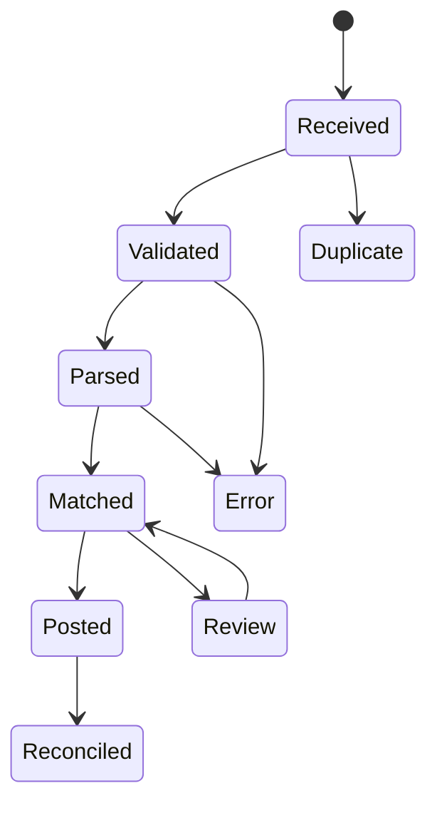
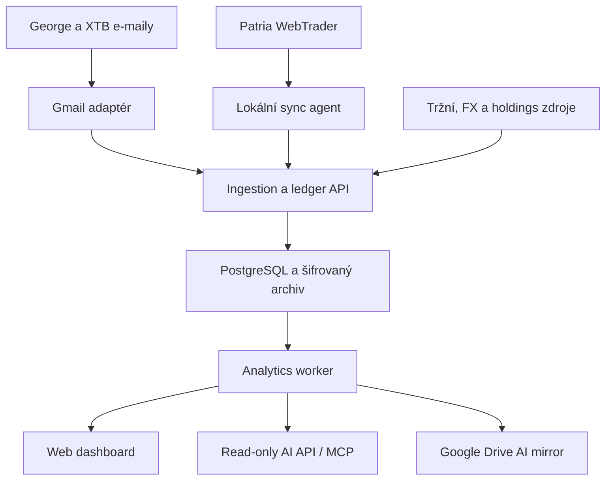

# Portfolio

Osobní aplikace pro automatizovaný sběr, sjednocení a analýzu investic napříč brokery. Cílem je mít jeden důvěryhodný pohled na celé portfolio, přestože jsou investice vedené v různých měnách, na různých platformách a v různých daňových režimech.

Tento dokument je produktová a technická specifikace pro první fázi vývoje. Stav návrhu a externích integrací byl naposledy ověřen 21. 7. 2026.

> [!IMPORTANT]
> Repozitář je veřejný. Nesmí obsahovat reálné výpisy, e-maily, zůstatky, transakce, čísla účtů, přístupové údaje, API klíče ani neanonymizované testovací soubory. Veškerá ukázková data musí být syntetická.

> [!NOTE]
> Aplikace je analytický a evidenční nástroj. Nezadává pokyny brokerům a neposkytuje investiční ani daňové poradenství.

## 1. Cíl projektu

Aplikace má:

- automaticky načítat data z Patria Finance, XTB a České spořitelny / George;
- vést úplnou a auditovatelnou historii transakcí, nikoli pouze aktuální pozice;
- agregovat všechny účty do jednoho dashboardu;
- současně umožnit filtrovat portfolio podle brokera, účtu a režimu `DIP` / `STANDARD`;
- vyhodnocovat výkonnost v CZK a volitelně v EUR;
- porovnávat výkonnost s proxy benchmarky S&P 500, MSCI World a MSCI ACWI;
- ukazovat ekonomickou expozici podle tříd aktiv, sektorů, zemí a měn;
- zprůhlednit překryvy ETF a skutečné podkladové pozice;
- poskytovat detailní, výhradně read-only přístup z běžných chatů v ChatGPT;
- minimalizovat ruční práci při každé aktualizaci.

### Hlavní produktové principy

1. **Ledger je zdroj pravdy.** Aktuální pozice a grafy se dopočítávají z neměnné historie událostí.
2. **Automatizace nesmí skrývat chyby.** Každý import má stav, původ, kontrolní součet a výsledek reconciliace.
3. **ISIN má přednost před tickerem.** Ticker se liší podle burzy a datového zdroje; jeden instrument může mít více listingů.
4. **Kontejner není expozice.** DIP je daňový režim účtu, ETF je právní forma instrumentu a akcie je ekonomická expozice. Tyto dimenze se vedou odděleně.
5. **Denní data jsou dostačující.** Aplikace není tradingový terminál a v první fázi nepotřebuje placená real-time data.
6. **Každé číslo musí být vysvětlitelné.** U ceny, FX kurzu, expozice i importu se ukládá zdroj, čas a kvalita.
7. **AI má pouze čtecí přístup.** ChatGPT nikdy nedostane obecný SQL nástroj, přístup k brokerskému účtu ani možnost měnit portfolio.

## 2. Rozsah

### Fáze 1 — povinný rozsah

| Oblast | Rozsah |
| --- | --- |
| Platformy | Patria Finance, XTB, Česká spořitelna / George |
| Daňový režim | `DIP`, `STANDARD`; hlavní dashboard je vždy nejprve agregovaný |
| Měny | primární reportovací měna CZK, přepnutí do EUR |
| Historie | obchody, vklady, výběry, dividendy, úroky, poplatky, daně, FX konverze, převody a relevantní korporátní akce |
| Výkonnost | hodnota portfolia, zisk/ztráta, TWR, XIRR, realizovaný a nerealizovaný výsledek, náklady, příjmy, FX vliv |
| Benchmarky | volitelně S&P 500, MSCI World, MSCI ACWI prostřednictvím jasně označených ETF proxy |
| Expozice | ekonomická třída aktiv, sektor, geografie, měna, efektivní podkladové pozice a překryvy ETF |
| Automatizace | e-mailový import pro George a XTB; pro Patrii automatizovaný lokální agent nebo řízený ruční fallback |
| ChatGPT | read-only Portfolio API zabalené jako ChatGPT app / MCP; Google Drive AI mirror jako fallback a auditovatelný snapshot |
| Provoz | single-user aplikace, audit importů, monitoring čerstvosti dat, zálohy |

### Výslovně mimo fázi 1

- plánovaná nebo cílová alokace;
- odchylka od plánované alokace;
- návrhy rebalancování;
- automatické obchodování nebo odesílání pokynů;
- predikce cen a generování investičních doporučení;
- hotové daňové přiznání nebo závazný výpočet daňové povinnosti;
- intradenní a real-time tržní data;
- nativní mobilní aplikace;
- více uživatelů a sdílení portfolia.

Plánovaná alokace a rebalancování mohou být pouze položkou pozdějšího backlogu. V datovém modelu ani UI první fáze pro ně není potřeba vytvářet obrazovky nebo povinná pole.

### Budoucí rozšíření

Datový model má bez migrace základních principů umožnit pozdější přidání například Rentea / DPS, Investown, Conseq, OneInvest a dalších účtů nebo nelikvidních aktiv. `DPS` je proto budoucí hodnota daňového režimu, ne součást první fáze importů.

## 3. Uživatelské rozhraní

### 3.1 Hlavní dashboard

Výchozí pohled zobrazuje celé portfolio dohromady — všechny platformy, DIP i klasické investice. V horní liště jsou globální filtry:

- období: 1M, 3M, YTD, 1Y, 3Y, 5Y, MAX a vlastní rozsah;
- režim: `Vše`, `DIP`, `Klasické`;
- broker a konkrétní účet;
- reportovací měna: CZK / EUR;
- benchmarky: žádný nebo jedna až tři z nabízených proxy řad.

Každý widget respektuje stejné filtry. Aktivní filtr musí být viditelný a sdílený v URL, aby šel konkrétní pohled znovu otevřít.

#### KPI karty

- aktuální tržní hodnota a datum posledního ocenění;
- čisté externí vklady;
- absolutní zisk/ztráta;
- TWR za zvolené období;
- XIRR od založení a případně za zvolené období;
- realizovaný a nerealizovaný výsledek;
- dividendy a úroky;
- poplatky, sražené daně a identifikované FX náklady;
- změna dnes / YTD / od počátku, pouze pokud jsou pro ni dostatečně čerstvá data.

U každého čísla má být tooltip s definicí a odkazem na metodiku. Neúplná hodnota se nezobrazuje jako přesná: dostane stav `estimated`, `partial` nebo `stale`.

#### Graf hodnoty a výkonnosti

Graf podporuje tři režimy:

1. **Hodnota portfolia** — tržní hodnota v reportovací měně a volitelně kumulované čisté vklady.
2. **Normalizovaná výkonnost** — portfolio a benchmarky mají na začátku hodnotu 100; portfolio používá TWR.
3. **Stejné peněžní toky** — hypotetická hodnota benchmarkové investice, do které přitékají stejné externí vklady a odtékají stejné výběry ve stejných dnech jako u portfolia.

Volitelně lze zobrazit relativní náskok/ztrátu portfolia proti vybranému benchmarku. Všechny řady se počítají ve stejné reportovací měně a včetně reinvestovaných distribucí, pokud to zvolená proxy umožňuje.

#### Alokace a expozice

- podle brokera;
- podle daňového režimu (`DIP`, `STANDARD`);
- podle účtu;
- podle právního typu instrumentu: ETF, akcie, podílový fond, dluhopis, crowdfunding, penzijní produkt, hotovost, ostatní;
- podle ekonomické třídy aktiv: akcie, dluhopisy, nemovitosti, PE/VC, hotovost, komodity, ostatní;
- podle sektoru;
- podle geografie;
- podle měnové expozice;
- top 10 přímých i efektivních podkladových pozic;
- překryvy mezi ETF a koncentrace na stejné podkladové společnosti.

Sektorová a geografická čísla musí rozlišovat `direct` a `look-through`. Pokud není podkladové složení fondu dostupné, zbytek se vede jako `Unknown`; nesmí se tiše přerozdělit mezi známé položky.

#### Další analytika

- příspěvek jednotlivých instrumentů, brokerů a účtů k výnosu;
- historický drawdown a maximální drawdown;
- anualizovaná volatilita;
- Sharpe a Sortino ratio s uvedeným bezrizikovým výnosem a periodou;
- koncentrace top 5 / top 10 a HHI;
- podíl hotovosti;
- dividendový a úrokový příjem v čase;
- nákladovost: explicitní poplatky, daně a odhadovaný TER držených fondů, pokud jsou data dostupná;
- FX příspěvek k výsledku;
- čerstvost dat a poslední úspěšná synchronizace každého zdroje.

### 3.2 Detail brokera a účtu

Každý broker má stránku se stejnými základními metrikami jako globální dashboard, ale omezenými na jeho účty. Stránka obsahuje:

- souhrn hodnoty a výkonnosti;
- účty a jejich daňový režim;
- aktuální pozice;
- hotovost podle měny;
- časovou osu transakcí;
- vklady, výběry, poplatky, dividendy a daně;
- stav posledního importu a poslední reconciliace;
- odkaz na zdrojový import bez vystavení citlivého dokumentu v URL.

### 3.3 Holdings

Pozice se primárně agregují podle instrumentu / ISIN napříč brokery. Uživatel může pozici rozbalit na jednotlivé účty a nákupní loty.

Sloupce:

- název, ISIN, ticker a burza použitá pro cenu;
- množství;
- průměrná pořizovací cena pro analytické účely;
- tržní cena, měna, zdroj a čas;
- tržní hodnota;
- nerealizovaný výsledek;
- váha v portfoliu;
- broker, účet a daňový režim;
- kvalita a stáří ocenění.

### 3.4 Transactions

Plně filtrovatelný a exportovatelný ledger. Minimální filtry:

- datum obchodu a vypořádání;
- broker / účet / daňový režim;
- instrument / ISIN;
- typ události;
- měna;
- zdroj importu a stav validace.

Každý řádek zobrazuje hrubou částku, množství, cenu, poplatek, daň, použitý FX kurz a odkaz na auditní stopu. Oprava importu nevynuluje historii: vytvoří storno/reversal a novou opravenou událost.

### 3.5 Exposures

Samostatný analytický pohled pro:

- třídy aktiv;
- sektor;
- zemi a region;
- měnu ekonomické expozice a měnu obchodování;
- podkladové společnosti;
- překryvy fondů;
- pokrytí look-through daty a jejich datum.

Metodika geografie musí být u každého zdroje popsaná. Země registrace emitenta, země tržeb a klasifikace vydavatele fondu nejsou totéž.

### 3.6 Data sources / Import health

Technická obrazovka, bez které nelze automatizaci považovat za spolehlivou:

- poslední kontrola schránky nebo zdroje;
- poslední nalezený a poslední úspěšný dokument;
- počet importovaných, duplicitních a chybných událostí;
- nereconciliované rozdíly;
- chybějící ceny, FX kurzy a mapování instrumentů;
- stáří portfolio a exposure snapshotů;
- možnost bezpečně zopakovat idempotentní import;
- možnost stáhnout anonymizovaný diagnostický protokol.

## 4. Metodika výpočtů

### 4.1 Čas a měna

- Interní čas se ukládá v UTC; obchodní datum, datum vypořádání a původní časová zóna se zachovají.
- Primární reportovací měna je CZK, volitelná EUR.
- Původní částky a měny se nikdy nepřepisují přepočtenými hodnotami.
- Historická ocenění používají FX kurz příslušného dne, ne dnešní kurz.
- Víkendy a svátky používají poslední známou cenu s příznakem `carried_forward`.

### 4.2 Peněžní toky

Externí cash flow je vklad do investičního systému nebo výběr z něj. Nákup, prodej, dividendová reinvestice a FX konverze uvnitř sledovaného portfolia nejsou externí cash flow. Převod mezi dvěma sledovanými účty se páruje a pro celek je interní; ve view jednoho účtu se může projevit jako transfer.

### 4.3 TWR a XIRR

- **TWR** měří investiční výkonnost očištěnou o načasování externích peněžních toků. Subperiody se dělí v okamžiku cash flow; pokud dokument obsahuje jen datum, použije se jednotná konvence konce dne a ta se uvede v metodice.
- **XIRR / money-weighted return** pracuje se skutečnými daty externích vkladů a výběrů a s koncovou hodnotou portfolia. Vyjadřuje osobní výsledek investora včetně načasování vkladů.

Obě metriky jsou potřebné, protože odpovídají na jinou otázku. UI nesmí jednu označovat pouze obecným slovem „výnos“.

### 4.4 Zisk, náklady a příjmy

- absolutní výsledek = koncová hodnota + externí výběry − externí vklady;
- realizovaný a nerealizovaný výsledek se počítá odděleně;
- poplatky a daně se vedou jako samostatné události, i pokud jsou součástí brokerova souhrnného řádku;
- dividendy a úroky se ukládají v hrubé i čisté podobě, pokud ji dokument poskytuje;
- nákupní loty se zachovají. Metoda agregace pořizovací ceny bude konfigurovatelná a nesmí být prezentována jako daňový výpočet.

### 4.5 Benchmarky

Indexy budou v první fázi reprezentované akumulačními UCITS ETF proxy, protože bezplatné total-return indexové řady nejsou vždy dostupné nebo licenčně použitelné.

| Volba v UI | Výchozí proxy | ISIN | Poznámka |
| --- | --- | --- | --- |
| S&P 500 | CSPX / SXR8 | `IE00B5BMR087` | stejný fond, listing se vybere podle dostupnosti dat |
| MSCI World | IWDA / SWDA / EUNL | `IE00B4L5Y983` | akumulační iShares Core MSCI World UCITS ETF |
| MSCI ACWI | SSAC / IUSQ | `IE00B6R52259` | akumulační iShares MSCI ACWI UCITS ETF |

V UI i exportech se používá název **ETF proxy benchmark**. Výsledek se může od samotného indexu lišit kvůli TER, tracking difference, daním, obchodním hodinám a měnovému přepočtu. Mapování proxy je konfigurovatelné, nikoli natvrdo zakódované v analytice.

### 4.6 Rizikové metriky

- volatilita se anualizuje z denních TWR výnosů pouze při dostatečném počtu pozorování;
- max drawdown se počítá z high-water mark normalizované TWR řady;
- Sharpe a Sortino mají verzovanou konfiguraci bezrizikové sazby;
- krátká historie zobrazí `insufficient_history`, nikoli zavádějící číslo;
- nelikvidní aktiva se zastaralými odhady se nesmí tvářit jako denně obchodované instrumenty a jejich vliv na volatilitu musí být označen.

## 5. Získávání dat od brokerů

### 5.1 Doporučená e-mailová infrastruktura

Pro importy je doporučen samostatný bezplatný Gmail účet používaný pouze pro portfolio. Důvody:

- dobře dokumentované Gmail API, OAuth 2.0 a read-only scopes;
- filtrování zpráv a štítky;
- snadný příjem přeposlaných e-mailů z hlavní schránky;
- Google Drive ve stejném účtu může sloužit jako AI mirror;
- možnost připojit Gmail a Google Drive k ChatGPT nezávisle na hlavním osobním účtu.

Doporučené štítky:

- `broker/george`, `broker/xtb`, `broker/patria`;
- `status/new`, `status/processed`, `status/error`, `status/duplicate`.

Preferovaný přístup je Gmail API s OAuth a rozsahem `gmail.readonly`. Periodické dotazování je pro osobní aplikaci dostačující; push notifikace přes `users.watch` a Google Cloud Pub/Sub lze přidat později. IMAP s heslem aplikace je pouze fallback. Tokeny a hesla se ukládají do OS keychainu nebo secret manageru, nikdy do repozitáře.

E-mail je transport a archiv vstupu, nikoli databáze portfolia.

### 5.2 Česká spořitelna / George

Známý vstup:

- elektronický „Přehled obchodů“ zasílaný e-mailem po každé investiční transakci;
- elektronický „Přehled portfolia“ jako kontrolní snapshot, podle nastavení klienta;
- případné historické PDF pro prvotní backfill.

Tok:

1. George odešle výpis do hlavní schránky.
2. Pravidlo jej automaticky přepošle do portfolio Gmailu.
3. Gmail adaptér ověří odesílatele, předmět, MIME typ a kontrolní součet přílohy.
4. Parser vytěží obchod, poplatek, daň, měnu, ISIN a účet.
5. Normalizované události se zapíší do ledgeru.
6. Portfolio výpis se použije pro reconciliaci množství a hotovosti.

PSD2 rozhraní banky se pro investiční portfolio nepovažuje za primární cestu; open-banking API jsou zaměřená hlavně na platební účty.

### 5.3 XTB

Omezení: retailové XTB API bylo 14. 3. 2025 ukončeno. xStation umožňuje export historie do CSV/HTML a XTB zasílá denní a kvartální PDF výpisy e-mailem. Denní PDF vzniká mimo jiné po provedené transakci; je chráněno heslem.

Strategie:

- jednorázový ruční CSV export pro kompletní historický backfill;
- automatický import denních e-mailových výpisů pro nové transakce;
- kvartální PDF jako autoritativní kontrolní snapshot;
- heslo k PDF uložené odděleně v secret manageru / OS keychainu;
- CSV/HTML import ponechat jako nouzový fallback a diagnostický nástroj.

Parser musí správně rozlišit celé cenné papíry, případná frakční práva, hotovostní operace a dividendy. Rozdílné XTB obchodní účty jsou samostatné `account` záznamy.

### 5.4 Patria Finance

Patria poskytuje stav portfolia a transakční historii v zabezpečeném WebTraderu; elektronické výpisy jsou v klientské části dostupné kvartálně. Veřejně dokumentované retailové portfolio API není součástí návrhu.

Strategie ve dvou úrovních:

1. **Spolehlivý fallback:** ruční export podporovaného reportu / PDF a jeho idempotentní nahrání.
2. **Cílová automatizace:** lokální agent s Playwrightem stáhne report z již autorizované uživatelské relace a odešle normalizovaná data přes ingestion API.

Lokální agent:

- běží pouze na důvěryhodném zařízení uživatele;
- používá oddělený browser profil;
- neobchází MFA ani bezpečnostní mechanismy;
- neukládá brokerské heslo do aplikace, pokud lze zachovat autorizovanou relaci;
- při vypršení relace požádá o ruční přihlášení;
- nikdy neotevírá obrazovky pro zadání obchodního pokynu.

Úplná bezobslužnost u Patrie je „best effort“ a může být přerušena MFA, změnou webu nebo podmínek služby. UI proto musí ukazovat stáří posledních dat a mít rychlý ruční fallback. Před implementací automatizace je nutné ověřit podmínky služby a přesný dostupný formát exportu.

### 5.5 Importní pipeline



Každý import ukládá:

- broker, účet a typ dokumentu;
- Gmail `message_id`, název přílohy a SHA-256 obsahu;
- datum přijetí a období dokumentu;
- verzi parseru;
- počet nalezených, přijatých a odmítnutých událostí;
- anonymizovanou chybu a stav;
- vazbu každé ledger události na zdrojový dokument.

Idempotence je povinná. Stejná zpráva, příloha nebo brokerova transakce nesmí vytvořit druhou událost ani při opakovaném spuštění importu.

### 5.6 Reconciliace

Poziční snapshot z výpisu se porovná s pozicí dopočítanou z ledgeru:

`opening quantity + buys + transfers in + corporate actions − sells − transfers out = closing quantity`

Obdobně se kontroluje hotovost podle měny. Tolerance je explicitní a závisí na typu instrumentu. Rozdíl vytvoří `data_quality_issue`, který se neztratí při dalším importu, dokud není vysvětlen nebo opraven.

## 6. Tržní, FX a look-through data

### 6.1 Princip provider abstraction

Bezplatný zdroj nemá garantované pokrytí všech evropských listingů. Aplikace proto používá rozhraní poskytovatele, cache a fallback řetězec. Každý datový bod ukládá `provider`, `as_of`, `retrieved_at`, `quality`, `currency` a případnou poznámku k licenci.

Navržený řetězec pro denní ceny:

1. Twelve Data jako preferovaný dokumentovaný zdroj, pokud bezplatný tarif skutečně pokrývá konkrétní listing;
2. Alpha Vantage jako dokumentovaný fallback s nízkým denním limitem;
3. Stooq pro historický backfill tam, kde je symbol dostupný;
4. Yahoo Finance přes neoficiální adaptér pouze jako best-effort fallback;
5. oficiální NAV nebo factsheet emitenta fondu;
6. poslední známá cena označená `stale`, nikdy tiché dosazení nuly.

Limity a pokrytí bezplatných tarifů se mění. Nejsou zakódované jako produktový předpoklad; při implementaci se spustí acceptance test na všech reálně držených ISIN/listinzích a výsledek se uloží do `instrument_price_source` konfigurace.

Pro osobní EOD dashboard je důležitější konzistence, adjusted historie a správná měna než real-time quote.

### 6.2 FX

- primární zdroj pro přepočet do CZK: oficiální denní kurzovní lístky ČNB;
- fallback a křížové EUR kurzy: ECB reference rates;
- brokerem skutečně použitý kurz se zachová u transakce, pokud je ve výpisu;
- pro ocenění se používá referenční kurz; pro vyhodnocení skutečných nákladů brokerů transakční kurz;
- kurzový zdroj a konvence musí být viditelné v metodice.

### 6.3 Identifikace instrumentů

- primární identifikátor fondu nebo cenného papíru: ISIN;
- listing: ISIN + MIC burzy + ticker + obchodní měna;
- OpenFIGI lze použít pro mapování ISIN na FIGI a burzovní symboly;
- automatické mapování s více kandidáty vytvoří úkol k ručnímu potvrzení;
- ručně potvrzené mapování se verzovaně uloží a parser ho znovu nepřepisuje.

### 6.4 Složení fondů a look-through

Preferují se oficiální zdroje vydavatelů fondů, například detailní holdings soubory iShares, DWS/Xtrackers a Avantis. Importér uchovává:

- fond, datum složení a zdroj;
- podkladový ISIN / název / zemi / sektor / měnu;
- váhu;
- míru pokrytí a součet vah;
- původní klasifikaci a normalizovanou interní klasifikaci.

Efektivní váha podkladu v portfoliu je váha fondu v portfoliu násobená vahou podkladu ve fondu. Přímé držení stejné firmy se následně přičte. Tak vznikne skutečná top pozice a překryv mezi ETF.

## 7. Architektura

Hybridní architektura odděluje důvěryhodný importní prostor od online analytické aplikace.



### 7.1 Komponenty

| Komponenta | Odpovědnost |
| --- | --- |
| Web | Next.js / React dashboard, single-user přihlášení, grafy, filtry, import health |
| API | Python + FastAPI, doménová pravidla, ledger, dotazy, OpenAPI kontrakt |
| Worker | parsování, Gmail polling, ceny, FX, holdings, snapshots, reconciliace |
| Databáze | PostgreSQL, canonical ledger a odvozené snapshoty |
| Raw archive | šifrované originální dokumenty pro audit; oddělené od veřejného úložiště |
| Local agent | Patria browser automation a případně lokální Gmail režim |
| AI adapter | read-only MCP nástroje nad stejnou aplikační službou jako dashboard |
| AI mirror | stabilní Markdown/CSV/JSON snapshoty v dedikovaném Google Drive |

Redis ani složitý message broker nejsou pro první osobní verzi povinné. Plánované úlohy může zpočátku obsloužit samostatný worker s databázovou tabulkou jobů a PostgreSQL advisory lockem. Fronta se přidá až při prokázané potřebě.

### 7.2 Nasazení

Cílová varianta:

- API, web, worker a PostgreSQL běží nepřetržitě za HTTPS;
- přístup je single-user a chráněný OIDC / passkey-capable autentizací;
- lokální agent navazuje pouze odchozí spojení k ingestion API;
- brokerské přihlašovací údaje zůstávají lokálně;
- e-mailový adaptér může běžet lokálně nebo serverově. Serverová varianta zajišťuje aktualizace i při vypnutém počítači, ale vyžaduje bezpečně uložený Gmail refresh token;
- raw dokumenty jsou šifrované samostatným klíčem a mají definovanou retenční politiku;
- vývojové prostředí používá Docker Compose a syntetická data.

### 7.3 Navržená struktura monorepa

```text
portfolio/
├── apps/
│   ├── web/                 # Next.js frontend
│   ├── api/                 # FastAPI HTTP + read-only AI service
│   ├── worker/              # importy, ocenění, snapshots, reconciliace
│   └── local-agent/         # Playwright a lokální integrace
├── packages/
│   ├── domain/              # doménové modely a výpočty
│   ├── parsers/             # george, xtb, patria
│   ├── market-data/         # prices, FX, instrument mapping, holdings
│   └── api-client/          # generovaný TypeScript klient z OpenAPI
├── migrations/
├── tests/
│   ├── fixtures-synthetic/
│   ├── golden/
│   ├── integration/
│   └── e2e/
├── docs/
│   ├── methodology.md
│   ├── data-sources.md
│   ├── security.md
│   └── adr/
├── infra/
├── .env.example
└── README.md
```

Verze frameworků se zvolí při založení projektu podle aktuálních stabilních/LTS vydání a uzamknou lockfilem; README je záměrně nepřipíná na čísla, která rychle zastarávají.

## 8. Doménový model

### 8.1 Hlavní entity

| Entita | Klíčová pole a účel |
| --- | --- |
| `broker` | Patria, XTB, George; normalizované jméno a konfigurace adaptéru |
| `account` | broker, externí pseudonym, měny, `tax_wrapper`, aktivní období |
| `instrument` | ISIN, název, právní typ, ekonomická třída, domicile, emitent |
| `listing` | instrument, MIC, ticker, obchodní měna, provider symboly |
| `ledger_event` | append-only ekonomická událost s datem, množstvím, částkami a zdrojem |
| `cash_leg` | měna, částka, směr a vazba na událost; FX konverze má nejméně dvě nohy |
| `lot` | nákupní množství, pořizovací cena a následná alokace prodeje |
| `raw_import` | hash, broker, dokument, parser version, stav, audit |
| `price` | listing/instrument, datum, close/NAV, měna, provider, quality |
| `fx_rate` | datum, pár, kurz, provider a konvence |
| `position_snapshot` | odvozené množství a hodnota účtu k datu |
| `portfolio_snapshot` | denní agregovaná hodnota, externí flow a výnos |
| `fund_holding_snapshot` | look-through složení fondu k datu |
| `exposure_snapshot` | agregace podle třídy, sektoru, země, měny a podkladu |
| `benchmark_series` | verzovaná proxy a denní přepočtená řada |
| `data_quality_issue` | rozdíl, chybějící data, závažnost, stav a vysvětlení |

### 8.2 Daňový režim

`tax_wrapper` je vlastnost účtu, nikoli brokera nebo instrumentu:

```text
DIP
STANDARD
# future: DPS
```

Jeden broker může mít více účtů s různými režimy. Hlavní dashboard agreguje vše; globální filtr stejná data rozdělí. Všechny relevantní dotazy, snapshots a AI nástroje proto přijímají volitelný `tax_wrapper` filtr.

### 8.3 Typ události

Minimální enum:

```text
BUY
SELL
DEPOSIT
WITHDRAWAL
DIVIDEND
INTEREST
FEE
TAX
FX_CONVERSION
TRANSFER_IN
TRANSFER_OUT
SPLIT
MERGER
SPINOFF
RETURN_OF_CAPITAL
ADJUSTMENT_REVERSAL
```

Brokerův řádek lze rozložit na jednu hlavní událost a více peněžních noh. Například BUY obsahuje množství a cenu instrumentu, hrubou hotovostní nohu a samostatný poplatek. Zdrojová čísla zůstanou dohledatelná.

### 8.4 Důležité invariants

- ledger událost se po zaúčtování nemění; oprava probíhá reverzní událostí;
- stejný `source_fingerprint` je možné zaúčtovat nejvýše jednou;
- součet cash legs jedné FX konverze je po přepočtu vysvětlitelný kurzem a poplatkem;
- quantity instrumentu nesmí být bez explicitní short pozice záporná;
- každý denní snapshot odkazuje na konkrétní sadu cen a FX kurzů;
- součet známých a `Unknown` look-through vah odpovídá pokrytí fondu;
- `DIP` / `STANDARD` se dědí z účtu a nekopíruje jako editovatelná pravda do každé transakce.

## 9. API

Dashboard i AI používají stejnou aplikační vrstvu. Příklad read API:

```text
GET /v1/portfolio/summary
GET /v1/portfolio/performance
GET /v1/portfolio/holdings
GET /v1/portfolio/exposures
GET /v1/portfolio/income
GET /v1/portfolio/costs
GET /v1/transactions
GET /v1/accounts
GET /v1/brokers/{broker_id}
GET /v1/data-quality/issues
GET /v1/imports/status
GET /v1/methodology
```

Společné parametry:

```text
from, to, reporting_currency, broker_id, account_id, tax_wrapper, benchmark
```

Write API je oddělené a dostupné pouze interním importérům s jiným oprávněním. OpenAPI kontrakt je verzovaný. Velké seznamy používají cursor pagination; částky se přenášejí jako decimal string, ne binární float.

## 10. Přístup z ChatGPT

### 10.1 Požadovaný výsledek

Uživatel má být schopný otevřít běžný chat a zeptat se například:

- „Jaká je moje efektivní expozice na USA po započtení ETF?“
- „Kolik jsem od začátku zaplatil na poplatcích u jednotlivých brokerů?“
- „Porovnej DIP a klasické investice za poslední tři roky.“
- „Které podkladové firmy se mi nejvíc překrývají mezi fondy?“
- „Proč se liší TWR a XIRR?“
- „Jsou data všech brokerů aktuální a reconciliovaná?“

### 10.2 Primární integrace: read-only ChatGPT app / MCP

Nad Portfolio API vznikne úzký MCP adaptér a následně soukromě nainstalovaná ChatGPT app/plugin. Nemá obecný HTTP proxy ani SQL nástroj; publikuje pouze omezené analytické nástroje:

```text
get_portfolio_summary
get_performance
get_holdings
get_transactions
get_exposures
get_income_and_costs
get_import_status
get_data_quality_issues
get_methodology
```

Každý nástroj:

- je read-only;
- má omezený rozsah parametrů a maximální velikost odpovědi;
- podporuje `DIP`, `STANDARD` i agregovaný pohled;
- vrací `as_of`, `data_freshness`, `currency`, `methodology_version` a zdroje;
- loguje přístup bez ukládání obsahu odpovědi s citlivými daty;
- nikdy nevrací e-mailové tokeny, raw dokumenty ani čísla brokerských účtů.

Backend musí být dostupný přes veřejné HTTPS a chráněný OAuth/OIDC. Dostupnost developer mode a způsob aktivace app v běžném chatu se ověří na konkrétním ChatGPT tarifu během implementace; klient může vyžadovat zvolení app pro daný chat. Architektura na tom není závislá, protože MCP a web používají stejné read API.

### 10.3 Sekundární integrace: Google Drive AI mirror

Worker po každé úspěšné aktualizaci atomicky vygeneruje do dedikovaného Google Drive:

```text
portfolio-summary.md
holdings-current.csv
transactions-YYYY.csv
performance-daily.csv
exposures-current.json
portfolio-methodology.md
data-freshness.md
```

Tyto soubory jsou stabilní, strojově čitelné a neobsahují credentials ani raw výpisy. Připojený Google Drive umožní ChatGPT načíst aktuální snapshot i v případě, že vlastní MCP integrace není v daném plánu nebo klientu dostupná.

AI mirror není source of truth a ChatGPT z něj nic nezapisuje zpět. Při větším množství transakcí je primární MCP API přesnější a efektivnější než agregace mnoha e-mailů nebo souborů přímo v chatu.

## 11. Bezpečnost a soukromí

### Threat model

Chráněná aktiva:

- historie portfolia a zůstatky;
- raw výpisy a jejich hesla;
- Gmail OAuth token;
- session / credentials pro Patrii;
- API a AI přístupové tokeny;
- šifrovací a zálohovací klíče.

Povinná opatření:

- žádné secrets v Gitu, Docker image, logu nebo analytice;
- `.env.example` pouze s názvy proměnných a bezpečnými placeholdery;
- OAuth scopes s nejmenším oprávněním, pro Gmail primárně read-only;
- oddělené identity pro importer, web a AI read API;
- TLS, bezpečné cookies, CSRF ochrana a rate limiting;
- šifrování databáze/disku a aplikační šifrování zvlášť citlivých raw dokumentů;
- heslo k PDF ukládat odděleně od dokumentu;
- redakce PII a částek v chybových zprávách;
- audit přihlášení a importů;
- automatické zálohy a pravidelně ověřená obnova;
- možnost zneplatnit AI token bez dopadu na dashboard;
- Content Security Policy a zákaz veřejných object-storage URL;
- dependency a secret scanning v CI.

Raw dokumenty lze po úspěšné reconciliaci přesunout do dlouhodobého šifrovaného archivu. Retence se nastaví před ostrým provozem. Mazání raw dokumentu nesmí rozbít auditní metadata a hash.

## 12. Spolehlivost a observability

Plánované úlohy:

| Úloha | Doporučená frekvence |
| --- | --- |
| kontrola Gmailu | každých 5–15 minut |
| ceny a benchmarky | jednou denně po uzavření relevantních trhů + opravný běh |
| ČNB / ECB FX | jednou denně |
| portfolio snapshot | po novém importu a po denních cenách |
| fund holdings | týdně až měsíčně podle zdroje |
| reconciliace | po každém kontrolním výpisu a noční rychlá kontrola |
| záloha | denně, s delší týdenní/měsíční retencí |

Sledovat minimálně:

- `last_success_at` pro každý konektor;
- počet nových, duplicitních a chybných importů;
- délku fronty a dobu zpracování;
- chybějící cenu / FX / instrument mapping;
- počet otevřených reconciliation issues;
- stáří snapshotů;
- počet přístupů přes AI API a zamítnuté autorizace.

Alarm má být akční: například „XTB e-mail nebyl 30 dní“ nemusí být chyba, pokud nebyla transakce. Kritičtější je neúspěšné zpracování přijatého výpisu nebo starý kvartální kontrolní snapshot.

## 13. Testování

### Testovací vrstvy

- unit testy doménových výpočtů, FX a klasifikace cash flow;
- golden-file testy každého parseru na syntetických a anonymizovaných dokumentech;
- property testy invariantů ledgeru a idempotence;
- integrační testy databáze, migrací a provider fallbacků;
- contract testy OpenAPI a MCP odpovědí;
- end-to-end test hlavního dashboardu a filtrů `Vše / DIP / Klasické`;
- restore test zálohy;
- bezpečnostní test, že AI endpointy nemají write schopnost.

### Povinné scénáře

- opakovaný import stejného e-mailu nevytvoří duplicitu;
- stejná transakce v denním a kvartálním výpisu se spáruje;
- nákup v EUR, ocenění v CZK a následná FX změna;
- převod mezi dvěma sledovanými účty nemění výnos celého portfolia;
- split nebo jiná korporátní akce zachová ekonomickou hodnotu;
- chybějící cena vytvoří označenou mezeru/stale hodnotu, ne nulu;
- filtr DIP nemění data klasického účtu a naopak;
- agregovaný dashboard se rovná součtu účtů po eliminaci interních převodů;
- benchmark se stejnými cash flows investuje pouze externí toky;
- parser update lze bezpečně přehrát nad raw importem bez dvojího zaúčtování.

## 14. Vývojový plán

### Milník 0 — discovery a fixtures

- získat po jednom reprezentativním dokumentu a kompletní historický export z každé platformy;
- vytvořit bezpečně anonymizované nebo plně syntetické golden fixtures;
- sepsat přesné mapování polí a brokerových typů transakcí;
- ověřit všechny reálné ISIN/listingy u bezplatných price providerů;
- rozhodnout režim hostingu, raw retention a autentizaci;
- založit ADR pro ledger, import fingerprints, FX konvenci a benchmarky.

### Milník 1 — canonical ledger a ruční backfill

- monorepo, CI, databáze a migrace;
- broker/account/instrument/listing model;
- append-only ledger a import audit;
- XTB CSV a dostupné George/Patria historické importy;
- reconciliation engine;
- základní holdings a transactions UI.

### Milník 2 — automatické nové transakce

- dedikovaný Gmail, OAuth a filtry;
- XTB a George e-mailové PDF parsery;
- idempotentní worker, error queue a import health;
- kvartální reconciliation;
- lokální Patria agent nebo připravený ruční fallback;
- upozornění na chybu nebo zastaralá data.

### Milník 3 — dashboard a analytika

- denní ceny, FX a snapshots;
- globální dashboard a filtry `Vše / DIP / Klasické`;
- TWR, XIRR, zisk, příjmy, náklady a FX attribution;
- ETF proxy benchmarky ve třech režimech;
- sektorová, geografická, měnová a asset-class expozice;
- fund look-through, top podklady a overlap;
- rizikové a koncentrační statistiky.

### Milník 4 — ChatGPT a hardening

- read-only Portfolio API;
- MCP adaptér a soukromá ChatGPT app/plugin;
- Google Drive AI mirror;
- bezpečnostní review, rate limits a audit;
- backup/restore drill;
- provozní dokumentace a runbook.

### Pozdější backlog

- Rentea / DPS, Investown, Conseq, OneInvest a další zdroje;
- více metod ocenění nelikvidních aktiv;
- tax-lot reporty jako analytická pomůcka;
- plánovaná alokace, odchylky a rebalancování — až po samostatném produktovém rozhodnutí;
- mobilní/PWA optimalizace;
- notifikace a periodické portfolio reporty.

## 15. Definition of Done pro fázi 1

Fáze 1 je hotová, pokud:

1. existuje kompletní počáteční historie pro Patrii, XTB a George nebo je každá známá mezera viditelně označena;
2. nové George a XTB transakce se bez ručního importu objeví v aplikaci;
3. Patria má funkční automatizovaný nebo jednoduše proveditelný fallback proces a viditelnou čerstvost;
4. opakovaný import nevytváří duplicity;
5. vypočtené pozice se reconciliují s kontrolními výpisy;
6. hlavní dashboard agreguje všechny účty a umí `Vše / DIP / Klasické`;
7. fungují CZK i EUR pohledy a historické FX přepočty;
8. graf porovnává portfolio se všemi třemi ETF proxy benchmarky;
9. jsou dostupné TWR, XIRR, realizovaný/nerealizovaný výsledek, příjmy, náklady a základní rizikové statistiky;
10. asset-class, sektorová, geografická a měnová expozice ukazuje také míru pokrytí;
11. ChatGPT může přes read-only rozhraní získat detail holdings, transakcí, výkonu, expozic a čerstvosti dat;
12. žádný AI nástroj ani dashboard neumí zadat obchod;
13. záloha byla úspěšně obnovena v odděleném prostředí;
14. repozitář a test fixtures neobsahují osobní finanční data ani secrets.

## 16. Otevřená rozhodnutí před implementací

Nejde o změny produktového směru, ale o technická rozhodnutí, která vyžadují vzorky dokumentů nebo cílové prostředí:

- přesný formát a varianty PDF/CSV každého brokera;
- zda Gmail worker poběží serverově 24/7, nebo v první verzi v lokálním agentu;
- hosting webu/API/PostgreSQL a způsob single-user autentizace;
- retenční doba raw výpisů;
- přesný způsob bezpečného uložení hesla k XTB PDF;
- tolerance reconciliace pro frakční instrumenty;
- výchozí analytická metoda pořizovací ceny;
- dostupnost developer mode / soukromé app v konkrétním ChatGPT účtu;
- pravidla pro manuální ocenění budoucích nelikvidních aktiv.

## 17. Oficiální zdroje a technické reference

### Broker importy

- [XTB: ukončení API](https://www.xtb.com/int/help-center/our-platforms-6-4/does-xtb-offer-investment-automation-tools-4)
- [XTB: denní a kvartální výpisy](https://www.xtb.com/cz/help-center/obchodni-ucet-2/denni-a-kvartalni-vypisy)
- [XTB: export historie do CSV/HTML](https://www.xtb.com/en/help-center/our-platforms-6/history-on-the-xstation-platform)
- [Patria Finance: elektronické výpisy a portfolio](https://finance.patria.cz/vzdelavani/faq-investovani)
- [Česká spořitelna: investiční dokumentace a výpisy](https://www.csas.cz/banka/content/inet/internet/cs/RR_SK.INV..xml%2Cpdf_IE)

### E-mail a ChatGPT

- [Gmail API overview](https://developers.google.com/workspace/gmail/api/guides)
- [Gmail API: attachments.get](https://developers.google.com/workspace/gmail/api/reference/rest/v1/users.messages.attachments/get)
- [Gmail API: push notifications](https://developers.google.com/workspace/gmail/api/guides/push)
- [OpenAI: Apps in ChatGPT](https://help.openai.com/en/articles/11487775-connectors-in-chatgpt)
- [OpenAI: developer mode and MCP apps](https://help.openai.com/en/articles/12584461-developer-mode-and-mcp-apps-in-chatgpt)
- [OpenAI Apps SDK](https://developers.openai.com/apps-sdk)

### Tržní a klasifikační data

- [Twelve Data API](https://twelvedata.com/docs)
- [Alpha Vantage documentation](https://www.alphavantage.co/documentation/)
- [Stooq historical data](https://stooq.com/db/h/)
- [ČNB: kurzovní lístky](https://www.cnb.cz/en/financial-markets/foreign-exchange-market/central-bank-exchange-rate-fixing/)
- [ECB: euro reference exchange rates](https://www.ecb.europa.eu/stats/policy_and_exchange_rates/euro_reference_exchange_rates/html/index.en.html)
- [OpenFIGI API](https://www.openfigi.com/api/documentation)
- [iShares fund data](https://www.ishares.com/uk/individual/en/products/251882/ishares-msci-world-ucits-etf-acc-fund)
- [DWS / Xtrackers fund data](https://etf.dws.com/en-gb/IE00BL25JP72-msci-world-momentum-ucits-etf-1c/)
- [Avantis UCITS ETF data](https://www.avantisinvestors.com/ucitsetf/avantis-global-small-cap-value-ucits-etf/)

---

První implementační krok není kreslení dashboardu, ale vytvoření správného ledgeru, syntetických fixtures a reconciliace. Pokud bude tato vrstva přesná a auditovatelná, UI, automatizace i konverzace v ChatGPT nad ní mohou bezpečně růst.
